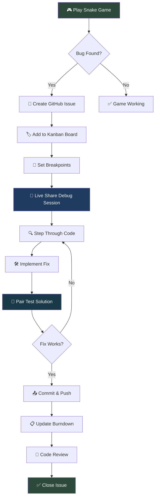

## Pair/Trio Programming Overview

The provided activities evaluates students in a Computer Science Project-based learning course. It focuses on **planning**, **code**, **debugging** and **reviews** to create a holistic profile of each student's computer science and software engineering skills.  It is best to work on these in pairs.

---

## 🐍 Snake Game Debugging Session

Transform pair/trio programming from theory to practice with an interactive Snake Game debugging challenge. This hands-on activity walks through the entire collaboration workflow while fixing real code issues.

---

### Problem - Debug Snake Game

Your team has inherited a Snake Game with multiple needs that prevent could improve gameplay. Your mission: work as a pair/trio to identify, document, and improve these issues using proper Agile methodologies.

**xSnake Game Improvements:**

- Background and Color could be improved
- Apple is white and could be red
- Score could look better
- Game speed could have more steps
- ...

---

### Activation - Learn How to Play Snake

Try debugging, to see where code is that activates features

---

### Demonstration - Workflow with Mermaid Diagram

Follow this debugging workflow as a team:



---

### Application - Debugging Practice Session

#### Step 1: Create Issues for Each Bug Type

Use this template for GitHub Issues:

**Issue Template:**
```
**Bug Title**: [Specific issue, e.g., "Snake passes through walls"]

**Description**: 
- What should happen: [Expected behavior]
- What actually happens: [Current broken behavior]
- Steps to reproduce: [How to trigger the bug]

**Acceptance Criteria**:
- [ ] [Specific fix requirement]
- [ ] [Test case to verify fix]

**Debug Strategy**:
- [ ] Set breakpoint at [specific function]
- [ ] Check [specific variable/condition]
- [ ] Test edge case: [specific scenario]
```

#### Step 2: Burndown Planning

Create a burndown list for your debugging session:

| Bug Priority | Issue | Estimated Time | Assigned To | Status |
|--------------|-------|----------------|-------------|---------|
| 🔴 High | CHange Apple | 30 min | Pair A | To Do |
| 🟡 Medium | Background Modification | 20 min | Pair B | To Do |
| 🟢 Low | Score display update | 15 min | Trio | To Do |

#### Step 3: Live Share Debugging Protocol

**Driver/Navigator Rotation:**

1. **Driver** (5 min): Controls keyboard, sets breakpoints
2. **Navigator** (5 min): Guides debugging strategy, reads code
3. **Observer** (5 min): Documents findings, updates issues

**Debugging Checklist:**

- [ ] Set breakpoint at change location
- [ ] Step through code with step or continue
- [ ] Check variable values at each step
- [ ] Identify the area to change
- [ ] Discuss fix with team before implementing
- [ ] Test change immediately after implementation

---

**Why?**
These steps ensure your work is organized, efficient, and quality. The provided infographics serve as examples of how your team should organize and divide work.

## Start Learning to Code Here:
- [Snake Game Lesson](/snakegaming/lesson.html)
- [Snake Game Hacks](/snakegaming/hacks.html)

### Snake Game Debugging Evaluation Table

Track your team's performance through the debugging session:

| Skill | Mastered (Y/N) | Rank (1-4) | Ratio | Notes/Evidence |
|-------|----------------|------------|-------|----------------|
| **Planning** | | | | |
| GitHub Issues | [ ] | 0 | 0.0 | Created clear bug reports with reproduction steps |
| Kanban Board | [ ] | 0 | 0.0 | Moved issues through debugging workflow stages |
| Burndown Lists | [ ] | 0 | 0.0 | Tracked time estimates vs actual debugging time |
| **Code** | | | | |
| Live Share | [ ] | 0 | 0.0 | Collaborated effectively during debugging sessions |
| Commits | [ ] | 0 | 0.0 | Made focused commits for each bug fix |
| Branch Mgmt | [ ] | 0 | 0.0 | Created feature branches for each bug fix |
| Forks/PRs | [ ] | 0 | 0.0 | Submitted PRs with clear fix descriptions |
| **Code Review** | | | | |
| Comments | [ ] | 0 | 0.0 | Left helpful debugging notes in code |
| Pair Testing | [ ] | 0 | 0.0 | Tested each fix thoroughly with teammate |
| Debugging | [ ] | 0 | 0.0 | Used breakpoints and step-through effectively |
| Code Review | [ ] | 0 | 0.0 | Reviewed teammate's fixes before merging |
| **Total** | 0 | 0 | 0.0 | |
| **Average** | | 0.0 | 0.0 | |

---

### Reflection Questions

After completing the Snake Game debugging session:

1. **Which debugging technique was most effective for your team?**
2. **How did the driver/navigator rotation impact your problem-solving?**
3. **What type of bug was hardest to identify and why?**
4. **How did using breakpoints change your debugging approach?**
5. **What would you do differently in your next debugging session?**
