## Overview

The provided outline evaluates students in a Computer Science Project-based learning course. It focuses on **planning**, **code**, **debugging** and **reviews** to create a holistic profile of each student's computer science and software engineering skills.  It is best to work on these in pairs.

---

## Review Session

Transform pair/trio programming from theory to practice by planning and debugging a task. This hands-on activity walks through the entire collaboration workflow while fixing or developing real code GitHub issues.

**Use the remainder of this lesson as an outline** Adapt for your course of action as related to your team project.

---

### From Theory to Practice

```mermaid
flowchart LR
    A[📚 Agile Concepts] --> B[🎯 Real Project]
    B --> C[👥 Pair Programming]
    C --> D[🐍 Snake Game Debug]
    
    A1[Planning] --> A
    A2[Code Review] --> A
    A3[Debugging] --> A
    A4[Collaboration] --> A
    
    D --> D1[🎮 Game Testing]
    D --> D2[🔍 Issue Discovery]
    D --> D3[🛠️ Code Fixes]
    D --> D4[✅ Validation]
    
    style A fill:#e1f5fe,color:#01579b
    style D fill:#f3e5f5,color:#4a148c
    style C fill:#e8f5e8,color:#1b5e20
```



**Ready to apply your skills?** The left side of chart is Agile Skill development, the right side will be adapted to your specific task.

---

### Illustrative Problem - Debug Snake Game

Your team has inherited a Snake Game with multiple issues that could improve gameplay. Your mission: work as a pair/trio to identify, document, and improve these issues using proper Agile methodologies.

*Note: While we use Snake Game as our example, you should adapt these techniques to your actual team project.*

**Snake Game Planned Improvements:**

- Background and colors could be improved
- Apple is white and could be red
- Score display could look better
- Game speed could have more steps
- ...

---

### Activation - Learn How to Play Snake

Before diving into debugging, familiarize yourself with the game mechanics. Try playing the game to see where the code activates features and understand the expected behavior.

---

### Demonstration - Workflow with Mermaid Diagram

Now that you understand the game, let's establish a systematic debugging workflow. Follow this debugging workflow as a team:

```mermaid
flowchart TD
    A[🎮 Play Snake Game] --> B{Bug Found?}
    B -->|Yes| C[📝 Create GitHub Issue]
    B -->|No| D[✅ Game Working]
    
    C --> E[🏷️ Add to Kanban Board]
    E --> F[🎯 Set Breakpoints]
    F --> G[👥 Live Share Debug Session]
    
    G --> H[🔍 Step Through Code]
    H --> I[🛠️ Implement Fix]
    I --> J[🧪 Pair Test Solution]
    
    J --> K{Fix Works?}
    K -->|Yes| L[📤 Commit & Push]
    K -->|No| H
    
    L --> M[📋 Update Burndown]
    M --> N[🔄 Code Review]
    N --> O[✅ Close Issue]
    
    style A fill:#2d4a3d,color:#ffffff
    style G fill:#1e3a5f,color:#ffffff
    style J fill:#1a3a4a,color:#ffffff
    style O fill:#2d4a3d,color:#ffffff
```



---

### Application - Debugging Practice Session

With the workflow established, it's time to put theory into practice. Work through these structured steps to debug your project systematically.

#### Step 1: Create Issues for Each Bug Type

Use this template for GitHub Issues:

**Issue Template:**
```
**Bug Title**: [Specific issue, e.g., "Snake passes through walls"]

**Description**: 
- What should happen: [Expected behavior]
- What actually happens: [Current broken behavior]
- Steps to reproduce: [How to trigger the bug]

**Acceptance Criteria**:
- [ ] [Specific fix requirement]
- [ ] [Test case to verify fix]

**Debug Strategy**:
- [ ] Set breakpoint at [specific function]
- [ ] Check [specific variable/condition]
- [ ] Test edge case: [specific scenario]
```

#### Step 2: Burndown Planning

Organize your debugging tasks with time estimates and assignments. Create a burndown list for your debugging session:

| Bug Priority | Issue | Estimated Time | Assigned To | Status |
|--------------|-------|----------------|-------------|---------|
| 🔴 High | Change Apple Color | 30 min | Pair A | To Do |
| 🟡 Medium | Background Modification | 20 min | Pair B | To Do |
| 🟢 Low | Score Display Update | 15 min | Trio | To Do |

#### Step 3: Live Share Debugging Protocol

Establish clear roles and responsibilities for effective pair programming. Use this rotation system to ensure everyone participates actively.

**Driver/Navigator Rotation:**

1. **Driver** (5 min): Controls keyboard, sets breakpoints
2. **Navigator** (5 min): Guides debugging strategy, reads code
3. **Observer** (5 min): Documents findings, updates issues

**Debugging Checklist:**

- [ ] Set breakpoint at target location
- [ ] Step through code using step or continue
- [ ] Check variable values at each step
- [ ] Identify the area that needs changes
- [ ] Discuss fix with team before implementing
- [ ] Test changes immediately after implementation

---

### Assessment - Snake Game Debugging Evaluation

Use this evaluation table to track your team's skill development throughout the debugging process. This assessment helps identify strengths and areas for improvement.

Track your team's performance through the debugging session:

| Skill | Mastered (Y/N) | Rank (1-4) | Ratio | Notes/Evidence |
|-------|----------------|------------|-------|----------------|
| **Planning** | | | | |
| GitHub Issues | [ ] | 0 | 0.0 | Created clear bug reports with reproduction steps |
| Kanban Board | [ ] | 0 | 0.0 | Moved issues through debugging workflow stages |
| Burndown Lists | [ ] | 0 | 0.0 | Tracked time estimates vs actual debugging time |
| **Code** | | | | |
| Live Share | [ ] | 0 | 0.0 | Collaborated effectively during debugging sessions |
| Commits | [ ] | 0 | 0.0 | Made focused commits for each bug fix |
| Branch Mgmt | [ ] | 0 | 0.0 | Created feature branches for each bug fix |
| Forks/PRs | [ ] | 0 | 0.0 | Submitted PRs with clear fix descriptions |
| **Code Review** | | | | |
| Comments | [ ] | 0 | 0.0 | Left helpful debugging notes in code |
| Pair Testing | [ ] | 0 | 0.0 | Tested each fix thoroughly with teammate |
| Debugging | [ ] | 0 | 0.0 | Used breakpoints and step-through effectively |
| Code Review | [ ] | 0 | 0.0 | Reviewed teammate's fixes before merging |
| **Total** | 0 | 0 | 0.0 | |
| **Average** | | 0.0 | 0.0 | |

---

### Reflection Questions

Take time to process your learning experience. Reflection is crucial for improving your collaborative debugging skills.

After completing the Snake Game debugging session:

1. **Which debugging technique was most effective for your team?**
2. **How did the driver/navigator rotation impact your problem-solving?**
3. **What type of bug was hardest to identify and why?**
4. **How did using breakpoints change your debugging approach?**
5. **What would you do differently in your next debugging session?**
