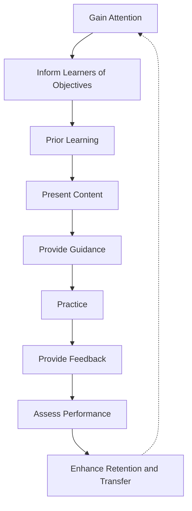
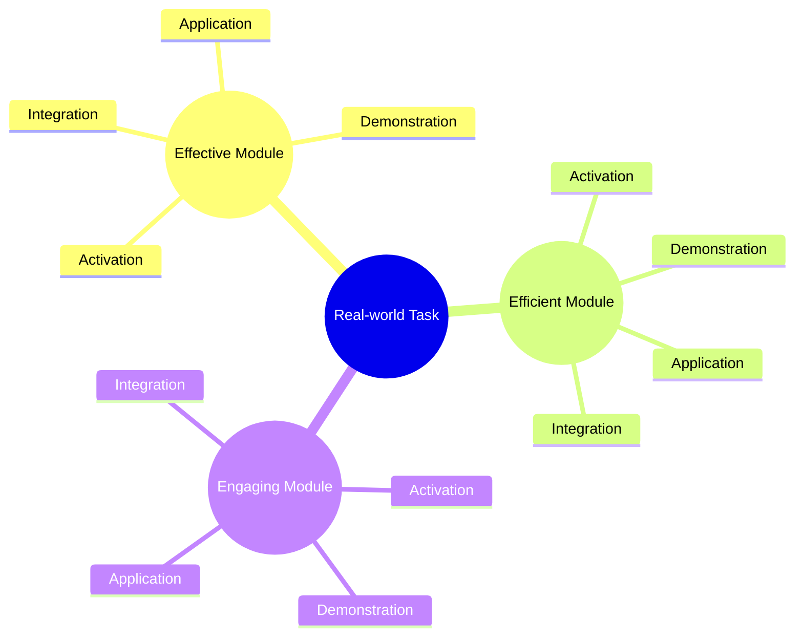

## Agile Development

Agile development and educational design share a common challenge: effective assessment and improvement require intentional planning and feedback.

- In software, Test Driven Development (TDD) ensures that testing is built into the development cycle. 
- In education, Backwards Design emphasizes starting with assessment goals before planning instruction. 
- Design Thinking brings these ideas together by centering the user—whether that’s a learner or a software customer—through empathy and defining a clear point of view (POV).

This approach ensures that each sprint is not just a sequence of tasks, but a continuous loop of improvement driven by user needs and team reflection.

### SPRINT CYCLE (2–4 Weeks)

1. Sprint Backlog
2. Plan
3. Empathy ↔ Interviews
4. Vision ↔ User Stories → POV
5. Ideate → Issues
6. Standup → Pinup → Kanban
7. Implementation → Test
8. Burndown (ideate review)
9. Retrospective (plan review)


## Incorporating Design Thinking (Section 1)

**Instructional Design vs. Learning Experience Design** a comparision.

**Instructional Design** is the traditional approach to creating learning opportunities. It focuses on identifying needs, setting goals, defining assessments, and establishing learning objectives using established frameworks and tools.

**Learning Experience Design (LxD)** evolves this thinking by emphasizing flexibility and responsiveness to the diverse needs, interests, and goals of learners. LxD aims for equitable outcomes and integrates elements from user experience design (UxD), graphics, games, and overall learner experience. The shift from Instructional Design to LxD is driven by new technologies, mobile learning, iterative development, and the importance of early feedback.

---

### Human-centered Design

Human-centered design puts the learner at the center of the solution. Content is developed from the learner’s perspective, with the goal of building solutions that are truly adapted to the audience.

The process is cyclical and includes:

- **Inspiration:** Understanding the learner’s context and needs.
- **Idea:** Generating creative solutions.
- **Implementation:** Bringing ideas to life in practical ways.
- **Iteration:** Continuously refining solutions based on feedback.

---

### Learning Experience Design

LxD is about designing learning that adapts to individual needs, interests, and goals, striving for equitable outcomes for all learners.

It incorporates principles from user experience, game design, and graphic design to create engaging and effective learning environments.

The key differences between Instructional Design and LxD are rooted in a more iterative, feedback-driven philosophy, and a focus on mobile and flexible learning.

---

### Instructional Design Process Models

**ADDIE Model:** The most well-known instructional design process, consisting of:

- **Analyze:** Define goals, audience, and resources.
- **Design:** Align instructional strategies to goals.
- **Develop:** Create learning resources and pilot test.
- **Implement:** Integrate resources into the learning environment and engage users.
- **Evaluate:** Assess the effectiveness of instruction and resources.

**SAM (Successive Approximation Model):** Focuses on iterative phases and tasks:

- **Preparation:** Background research and information gathering.
- **Iterative Design:** Design, prototype, and review.
- **Iterative Development:** Develop, implement, and evaluate (Alpha, Beta, Silver, Gold stages). SAM aims to make ADDIE more agile, though it still includes some pre-planned milestones.

- **Understanding by Design (UbD):** A backwards design approach:

  - 🎯 Identify desired results.
  - 📊 Determine assessment evidence.
  - 🛠️ Plan learning experiences and instruction.

---

### Design Thinking Process

Design Thinking is an innovative, human-centered, and non-sequential process that is integral to LxD.

The categories include:

- **Empathy:** Use observations, interviews, and focus groups to gain insights into learners’ thoughts and feelings. Understand user needs and challenges through research.
- **Define:** Craft a clear instructional problem statement and Point-Of-View (POV) based on findings. These can be personalized in the form of User Stories.
- **Ideate:** Brainstorm solutions, generating "How Might We" (HMW) questions from the POV to spark creativity.
- **Prototype:** Develop models or examples based on synthesized ideas and HMW questions. Be ready to modify prototypes as testing reveals new insights.
- **Test:** Refine solutions based on user feedback, iterating as needed to improve outcomes.


## Examining Various Approaches to Learning (Section 2)

### Instructional Approaches to Learning

- 🏆 **Behaviorist:** Learners respond to stimuli, and instructors obtain responses. This approach is especially valuable for young learners, where rewards (like gold stars) motivate learning.
- 🧠 **Cognitivist:** Focuses on memorization, organization, repetition, and well-defined problems as a foundation for deeper learning. Learners develop metacognition and adapt previous learning to new contexts. Learning is highly individual.
- 🛠️ **Constructivist:** Authentic learning is achieved by solving or creating real-world solutions. Group formation is key, and deep learning comes from producing tangible results. Learners have more control over their experience, such as choosing projects, compared to scripted learning outputs.
- 🔗 **Connectivist:** Leverages information systems, groups, and cultures with large quantities of information. Learners connect to systems and people to facilitate learning, often using the internet and AI. This approach builds on constructivist principles, with learners actively building knowledge through authentic choices and projects.

---

### Mastery Learning Approaches

- ✅ **Mastery Learning:** Learners must demonstrate mastery of a concept, skill, or procedure before moving on. In large classrooms, this is challenging, but learning analytics and adaptive technologies help personalize instruction and measure student success.
- ⏰ **Traditional Learning:** Progression is dictated by a predefined schedule, moving to the next skill based on time rather than mastery.
- 🏎️ **Competency-Based Education (CBE):** Learners move at their own pace with immediate formative feedback. CBE formalizes mastery learning, with frequent student-teacher interactions to measure success.

---

### Andragogy and Pedagogy

| Aspect                    | Andragogy (Adult Learning)         | Pedagogy (Child Learning)         |
|---------------------------|------------------------------------|-----------------------------------|
| Direction                 | Self-directed                      | Teacher-directed                  |
| Motivation                | Intrinsic                          | Extrinsic                         |
| Experience                | Experience as a resource           | Limited experience                |
| Content                   | Seeks relevant content             | Content defined by teacher        |
| Self-concept              | Established self-concept           | Self-concept dependent on teacher |
| Recognition               | Seeks recognition                  | Learning to reach next level      |
| Orientation               | Learning oriented to needs         | Learning oriented to teacher’s requirements |

---

### Educational Frameworks

- **Bloom’s Taxonomy:**

1. Remember
2. Understand
3. Apply
4. Analyze
5. Evaluate
6. Create

Bloom’s Pyramid illustrates how learning builds upward from the foundational level of Remember to the highest level, Create—emphasizing the concept of constructing knowledge on a solid base.

```text
              ^
            /    \
           /Create\
          /--------\
         / Evaluate \
        /------------\
       /    Analyze   \
      /----------------\
     /       Apply      \
    /--------------------\
   /       Understand     \
  /------------------------\
 /          Remember        \
/ ---------------------------\
 ```

- **Fink’s Significant Learning:** Holistic, affective
  - Intersection: All learning verbs intersect to form Foundational Knowledge. 
  - Foundational Knowledge: Content, facts
  - Application: Connecting concepts, solving problems, making decisions
  - Integration: Transfer knowledge to new subjects and real-world contexts
  - Human Dimension: Collaboration, understanding self and others
  - Caring: Feelings, Values
  - Metacognition: Independent, continual learning, learning to learn


- **Gagne’s 9 Events of Instruction:** Procedural and cognitive
  1. Gain Attention – Spark curiosity and relevance (e.g., compelling question, scenario, icebreaker)
  2. Inform Learners of Objectives – Clearly define purpose and intended outcomes
  3. Prior Learning – Activate or reinforce previous knowledge
  4. Present Content – Introduce concepts, demos, videos
  5. Provide Guidance – Scaffolding, rubrics, examples, references
  6. Elicit Performance (Practice) – Guided or independent work
  7. Provide Feedback – Timely, specific comments
  8. Assess Performance – Evaluate mastery
  9. Enhance Retention and Transfer – Apply in new contexts, use summaries, real-world tasks, reflection



- **Merrill’s Principles of Instruction:** Problem-based and modular.  
  - Pre-req: Begin with a real-world task or problem
  - Activation: Help learners activate prior knowledge
  - Demonstration: Provide clear models or examples
  - Application: Practice and apply learning, guided then independent
  - Integration: Reflect, share, or use new knowledge in meaningful contexts
  - Motto: Make instruction Effective, Efficient, Engaging


