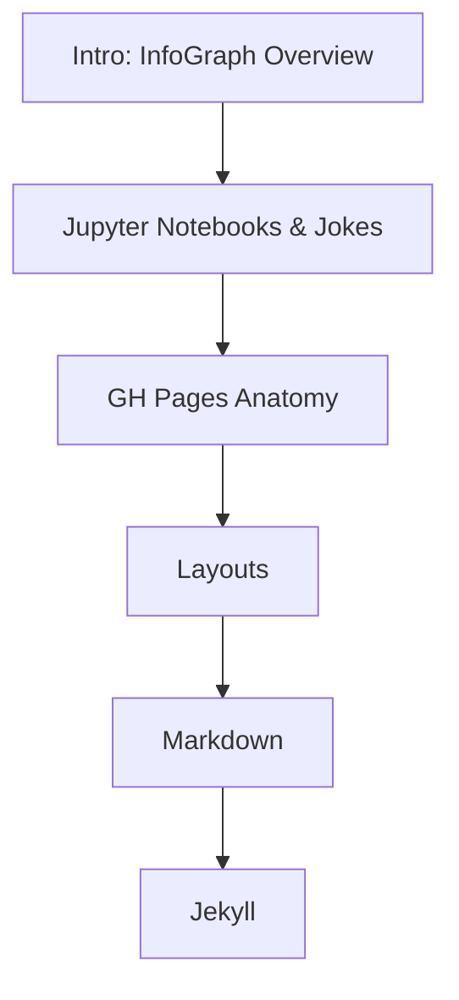

Welcome to your GitHub Pages mini-project journey! This InfoGraph series will guide you through essential skills for web programming, file management, and interactive notebooks. Each node below represents a hands-on activity or resource.

---

## How to Use This Series

- **Start at the top** and follow the arrows to progress through each topic.
- Complete each activity to build your skills and prepare for your own LxD experience.

- [Jupyter Notebooks & Jokes]({{site.baseurl}}/github/pages/jokes)
  - Learn JavaScript in Jupyter Notebooks with a fun twist—random programming and accounting jokes!
- [GH Pages Anatomy]({{site.baseurl}}/github/pages/anatomy)
- [Layouts]({{site.baseurl}}/github/pages/layouts)
- [Markdown]({{site.baseurl}}/github/pages/markdown)
- [Jekyll]({{site.baseurl}}/github/pages/jekyll)

---

> Ready to begin? Click a node in the InfoGraph above to jump to your next activity!