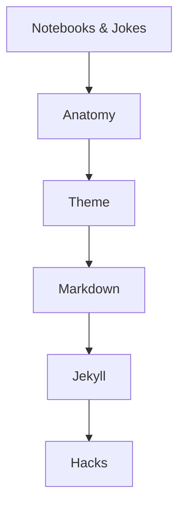

Welcome to your GitHub Pages mini-project journey! This series will guide you through essential skills for web programming with GitHub Pages.

---
## Table - How to Use This Series

<table style="width:100%; text-align:center; border-collapse:collapse;">
  <tr>
    <th><a href="{{site.baseurl}}/github/pages/jokes">Notebooks & Jokes</a></th>
    <th><a href="{{site.baseurl}}/github/pages/anatomy">Anatomy</a></th>
    <th><a href="{{site.baseurl}}/github/pages/layouts">Layouts</a></th>
    <th><a href="{{site.baseurl}}/github/pages/markdown">Markdown</a></th>
    <th><a href="{{site.baseurl}}/github/pages/jekyll">Jekyll</a></th>
    <th><a href="{{site.baseurl}}/github/pages/hacks">Hacks</a></th>
  </tr>
  <tr>
    <td>Fun with JavaScript and Jupyter Notebooks</td>
    <td>Explore the structure of a GitHub Pages site</td>
    <td>Learn about layouts and page templates</td>
    <td>Master Markdown for content creation</td>
    <td>Understand Jekyll static site generation</td>
    <td>Apply your knowledge with hands-on challenges</td>
  </tr>
</table>

## Markdown - How to Use This Series

- **Start at the top** and follow the arrows to progress through each topic.
- Complete each activity to build your skills and prepare for your own LxD experience.

- [Jupyter Notebooks & Jokes]({{site.baseurl}}/github/pages/jokes)
  - Learn JavaScript in Jupyter Notebooks with a fun twist—random programming and accounting jokes!
- [GH Pages Anatomy]({{site.baseurl}}/github/pages/anatomy)
  - Explore the structure of a GitHub Pages site
- [Theme]({{site.baseurl}}/github/pages/theme)
  - Learn about theme templates and layout of SASS files for advanced styling
- [Markdown]({{site.baseurl}}/github/pages/markdown)
  - Master Markdown for content creation
- [Jekyll]({{site.baseurl}}/github/pages/jekyll)
  - Understand Jekyll static site generation

---

> Ready to begin? Start building a LxD layout and articles to begin your LxD journey.