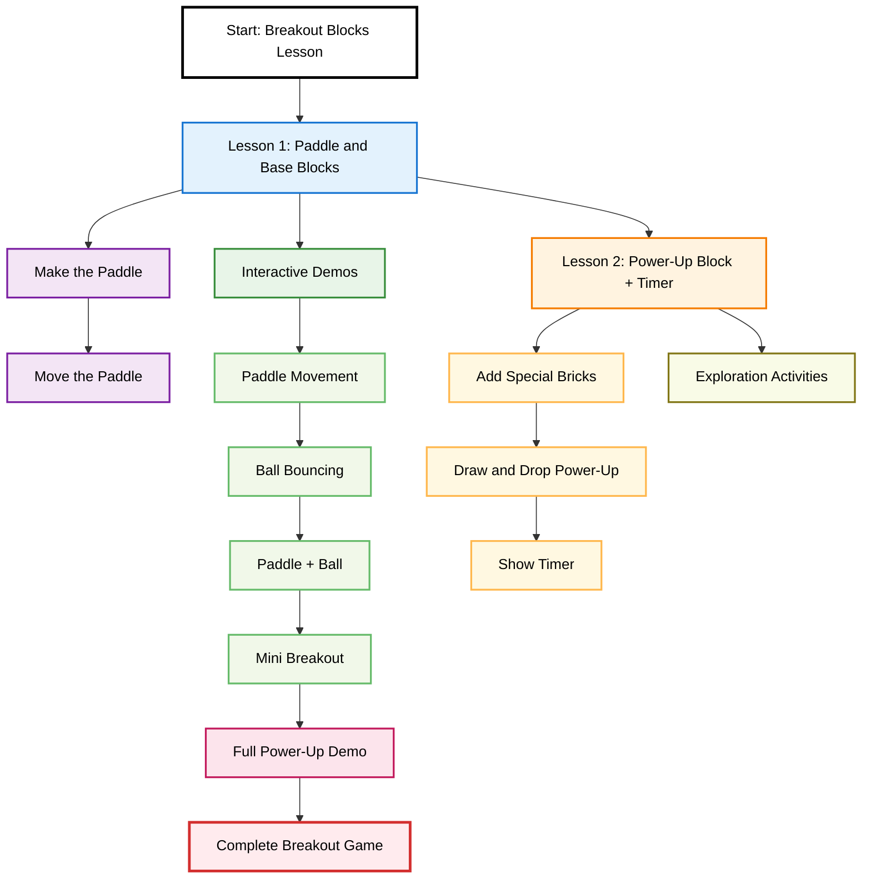

---
layout: opencs
author: Nikhil, Rohan, Pranav, Aditya, Shriya, Samhita
permalink: functionalbreakoutlesson
---

  <!-- Sidebar -->
  
  <aside class="lesson-sidebar">
    
      <h3>{{ page.sidebar_title }}</h3>
    

    <!-- Lesson Links -->
    
    <h4>Lessons</h4>
    <ul>
      
        <li><a href="{{ site.baseurl }}{{ link.url }}">{{ link.text }}</a></li>
      
    </ul>
    

    <!-- Time Tracker -->
    
    <h4>⏱️ Study Time</h4>
    
0:00

    
Active

    

    <!-- Progress -->
    
    <h4>📊 Your Progress</h4>
    

    
0% complete

    <button id="reset-progress" class="btn small-btn">Reset Progress</button>
    

    <!-- Badges -->
    
    <h4>🏅 Your Badges</h4>
    
No badges yet...

    
  </aside>
  

  <!-- Main Content -->
  <main class="lesson-content">
    <h1>{{ page.title }}</h1>
    

      {{ content }}
    

    
    

    

      <h3>🖥️ Try It Yourself</h3>
      <textarea id="sandbox-code">{{ page.sandbox_code | default: "// Type your code here" }}</textarea>
      <button id="run-sandbox">Run Code</button>
      <pre id="sandbox-output"></pre>
    

    

    
    

    

      
      <canvas id="blackboard-canvas"></canvas>
      
Press 'w' for white, press `r` for red, press `b` for blue, and press `g` for green. Press `c` to clear blackboard. 

    

    
  
    
    <!-- Note: utilizes script tags in the HTML file as cannot dynamically use information from frontmatter in lessonbase.js -->
    

    

      <label class="demo-label">
        <input type="checkbox" id="demo-toggle"> Show code
      </label>
      

        <canvas id="demo-canvas"></canvas>
        <!-- Make sure you put the normal JS code in the "demo_runtime_code" field in the frontmatter. -->
        
      

      <!-- Instead of writing '<' or '>' for brackets, use '&lt;' and '&gt;' else the HTML will actually be run instead of displayed. -->
      <pre id="demo-code" style="display:none; max-width:820px; margin:8px auto; overflow:auto;">
        <code>
          <!-- Need to use multiline YAML content in the frontmatter for the javascript -->
          {{ page.demo_display_code | default: console.log("No demo code provided.") }}
        </code>
      </pre>
    

    

    
    

    

      <h3>📝 Quick Check</h3>
      
{{ page.quiz_prompt | default: "What did you learn?" }}

      <textarea id="reflection-box"></textarea>
      <button id="save-reflection">Save</button>
      

    

    

    
    

    

      <h3>📚 Resources</h3>
      <ul>
        
          <li><a href="{{ r.url }}" target="_blank">{{ r.text }}</a></li>
        
      </ul>
    

    

    
    

      <a href="{{ page.prev_url }}" class="btn">⬅ Previous</a>
      <a href="{{ page.next_url }}" class="btn">Next ➡</a>
    

    
  </main>

<!-- Load your shared scripts & styles -->

<link rel="stylesheet" href="{{ '/assets/css/lessonbase.css' | relative_url }}">

<link
   rel="stylesheet"
   href="https://cdn.jsdelivr.net/npm/rippleui@1.12.1/dist/css/styles.css"
/>

<h1 class="hub-title">Functional Breakout (2-Part Mini Lesson)</h1>

<a href="{{site.baseurl}}/hacks" style="text-decoration:none;color:#007acc;font-weight:bold;">Click here to go back to main page</a>

 

---

 

<!-- ADD ICONS to the cards IN FUTURE! -->

	

		

			<h2 class="card-header">Functional Breakout: Lesson 1</h2>
			
Paddle and Base Blocks

			

				<a href="{{ site.baseurl }}/functionalbreakoutlesson1"><button class="btn-secondary btn">Go to lesson →</button></a>
			

		

	

	

		

			<h2 class="card-header">Functional Breakout: Lesson 2</h2>
			
Power-Up Block + Timer

			

				<a href="{{ site.baseurl }}/functionalbreakoutlesson2"><button class="btn-secondary btn">Go to lesson →</button></a>
			

		

	

---

<!-- ===================== Breakout Blocks: Checkpoint Quizzes ===================== -->

  <!-- Quiz A: Lesson 1 — Paddle & Base Blocks -->
  

    
Lesson 1 Checkpoint

    
Paddle setup, keyboard input, and bounds

    

      
1) Which variables track keyboard input for moving the paddle?

      <label class="option"><input type="checkbox" value="rightPressed">rightPressed</label>
      <label class="option"><input type="checkbox" value="leftPressed">leftPressed</label>
      <label class="option"><input type="checkbox" value="paddleHeight">paddleHeight</label>
      <label class="option"><input type="checkbox" value="paddleWidth">paddleWidth</label>
    

    

      
2) What prevents the paddle from leaving the canvas?

      <label class="option"><input type="radio" name="A2">Increasing <code>paddleWidth</code> when near the edge</label>
      <label class="option"><input type="radio" name="A2">Conditional checks on <code>paddleX</code> against 0 and <code>canvas.width - paddleWidth</code></label>
      <label class="option"><input type="radio" name="A2">Calling <code>ctx.closePath()</code> in <code>drawPaddle()</code></label>
    

    

      
3) Which events are used to update movement flags?

      <label class="option"><input type="checkbox" value="keydown">keydown</label>
      <label class="option"><input type="checkbox" value="keyup">keyup</label>
      <label class="option"><input type="checkbox" value="wheel">wheel</label>
      <label class="option"><input type="checkbox" value="resize">resize</label>
    

    <button class="check">Check Answers</button>
    <button class="clear">Clear</button>
    

  

  <!-- Quiz B: Lesson 2 — Power-Up Block + Timer -->
  

    
Lesson 2 Checkpoint

    
Spawning, catching, and timing a power-up

    

      
1) When a power-up brick is hit, what happens immediately?

      <label class="option"><input type="radio" name="B1">All bricks in the row disappear</label>
      <label class="option"><input type="radio" name="B1">A falling power-up object is pushed into <code>powerUps</code></label>
      <label class="option"><input type="radio" name="B1">Ball speed is permanently doubled</label>
    

    

      
2) What effect is applied when the paddle catches the power-up in the sample code?

      <label class="option"><input type="radio" name="B2">The paddle becomes narrower</label>
      <label class="option"><input type="radio" name="B2">The paddle becomes wider temporarily</label>
      <label class="option"><input type="radio" name="B2">The ball changes color</label>
    

    

      
3) Which variables manage the power-up’s duration?

      <label class="option"><input type="checkbox" value="activePowerUp">activePowerUp</label>
      <label class="option"><input type="checkbox" value="powerUpTimer">powerUpTimer</label>
      <label class="option"><input type="checkbox" value="powerUpDuration">powerUpDuration</label>
      <label class="option"><input type="checkbox" value="basePaddleWidth">basePaddleWidth</label>
    

    

      
4) What UI element communicates remaining time to the player?

      <label class="option"><input type="radio" name="B4">A vertical bar that fills/shrinks</label>
      <label class="option"><input type="radio" name="B4">A blinking paddle outline</label>
      <label class="option"><input type="radio" name="B4">An alert popup every second</label>
    

    <button class="check">Check Answers</button>
    <button class="clear">Clear</button>
    

  

  <!-- Quiz C: Interactive Demos — Ball Bouncing Logic -->
  

    
Demos Checkpoint

    
Ball bouncing conditions

    

      
1) Which condition flips the ball’s horizontal velocity?

      <label class="option"><input type="radio" name="C1"><code>bx + br &gt; canvas.width || bx - br &lt; 0</code></label>
      <label class="option"><input type="radio" name="C1"><code>by - br &lt; 0</code></label>
      <label class="option"><input type="radio" name="C1"><code>by + br &gt; canvas.height - paddleHeight</code></label>
    

    

      
2) In the Paddle + Ball demo, what causes a bounce off the paddle?

      <label class="option"><input type="radio" name="C2">Reaching the exact center of the canvas</label>
      <label class="option"><input type="radio" name="C2">Ball’s bottom touching paddle’s top while x is between paddle edges</label>
      <label class="option"><input type="radio" name="C2">Calling <code>ctx.closePath()</code> after drawing the paddle</label>
    

    <button class="check">Check Answers</button>
    <button class="clear">Clear</button>
    

  

  <!-- Quiz D: Mini Breakout — Bricks & Collision -->
  

    
Mini Breakout Checkpoint

    
Brick grid and collision clearing

    

      
1) How are brick positions assigned each frame in the sample?

      <label class="option"><input type="radio" name="D1">They are randomized every loop</label>
      <label class="option"><input type="radio" name="D1">Computed from row/column indices using offsets and padding, then stored to each brick’s <code>x,y</code></label>
      <label class="option"><input type="radio" name="D1">Hardcoded pixel coordinates for each brick</label>
    

    

      
2) What happens when the ball’s position overlaps a brick’s rectangle?

      <label class="option"><input type="radio" name="D2">Vertical velocity inverts and the brick’s <code>status</code> becomes 0</label>
      <label class="option"><input type="radio" name="D2">The ball teleports to center</label>
      <label class="option"><input type="radio" name="D2">All bricks immediately reset</label>
    

    

      
3) Select all parameters that define the brick layout grid:

      <label class="option"><input type="checkbox" value="rowCount">rowCount</label>
      <label class="option"><input type="checkbox" value="colCount">colCount</label>
      <label class="option"><input type="checkbox" value="bw">bw (brick width)</label>
      <label class="option"><input type="checkbox" value="bt">bt (top offset)</label>
      <label class="option"><input type="checkbox" value="gravity">gravity</label>
    

    <button class="check">Check Answers</button>
    <button class="clear">Clear</button>
    

  

<!-- =================== /End Breakout Blocks: Checkpoint Quizzes =================== -->