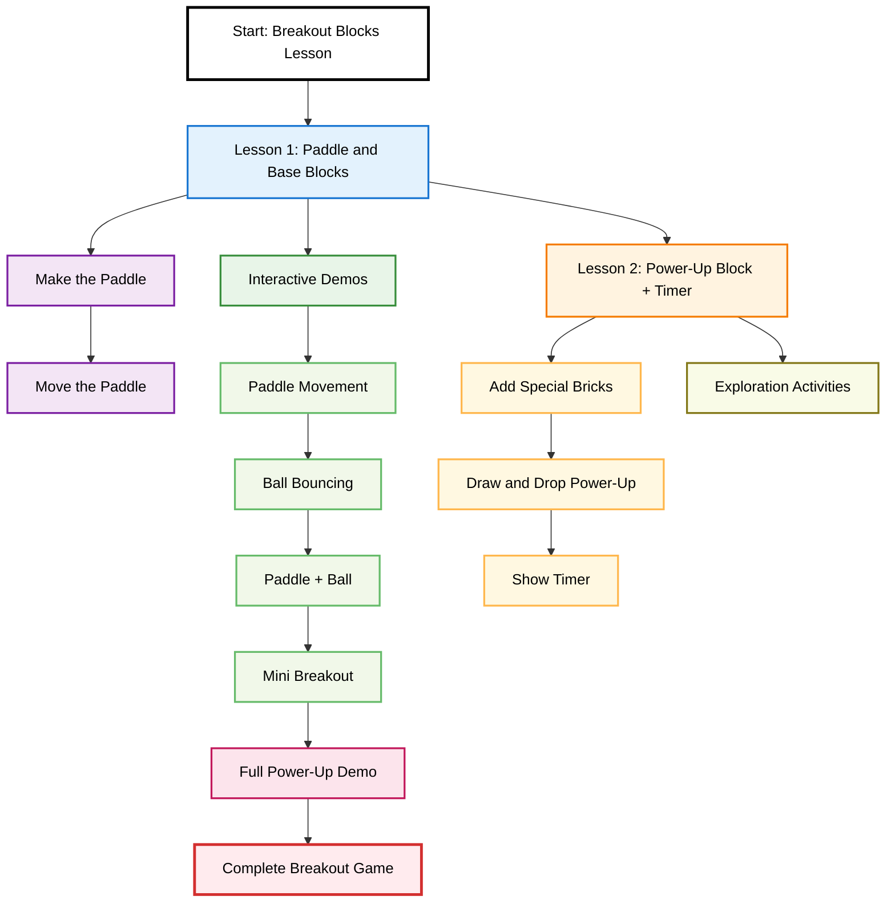

<h1 class="breakout-title">Functional Breakout (2-Part Mini Lesson)</h1>

<a href="{{site.baseurl}}/hacks" class="breakout-btn">Click here to go back to main page</a>

 

---

 

<!-- ADD ICONS to the cards IN FUTURE! -->

	

		

			<h2 class="card-header">Functional Breakout: Lesson 1</h2>
			
Paddle and Base Blocks

			

				<a href="{{ site.baseurl }}/functionalbreakoutlesson1"><button class="btn-secondary btn">Go to lesson →</button></a>
			

		

	

	

		

			<h2 class="card-header">Functional Breakout: Lesson 2</h2>
			
Power-Up Block + Timer

			

				<a href="{{ site.baseurl }}/functionalbreakoutlesson2"><button class="btn-secondary btn">Go to lesson →</button></a>
			

		

	

---

  
Lesson 1 Checkpoint

  

    
1) Which variables track keyboard input for moving the paddle?

    <label><input type="checkbox" name="q1" value="rightPressed"> rightPressed</label>
    <label><input type="checkbox" name="q1" value="leftPressed"> leftPressed</label>
    <label><input type="checkbox" name="q1" value="paddleHeight"> paddleHeight</label>
    <label><input type="checkbox" name="q1" value="paddleWidth"> paddleWidth</label>
  

  

    
2) What prevents the paddle from leaving the canvas?

    <label><input type="radio" name="q2" value="IncreaseWidth"> Increasing <code>paddleWidth</code> when near the edge</label>
    <label><input type="radio" name="q2" value="Conditional checks on paddleX against 0 and canvas.width - paddleWidth"> Conditional checks on <code>paddleX</code> against 0 and <code>canvas.width - paddleWidth</code></label>
    <label><input type="radio" name="q2" value="ClosePath"> Calling <code>ctx.closePath()</code> in <code>drawPaddle()</code></label>
  

  

    
3) Which events are used to update movement flags?

    <label><input type="checkbox" name="q3" value="keydown"> keydown</label>
    <label><input type="checkbox" name="q3" value="keyup"> keyup</label>
    <label><input type="checkbox" name="q3" value="wheel"> wheel</label>
    <label><input type="checkbox" name="q3" value="resize"> resize</label>
  

  <button class="breakout-quiz-btn" onclick="checkQuiz(this)">Check answers</button>
  <button class="breakout-quiz-btn" onclick="resetQuiz(this)">Reset</button>
  

