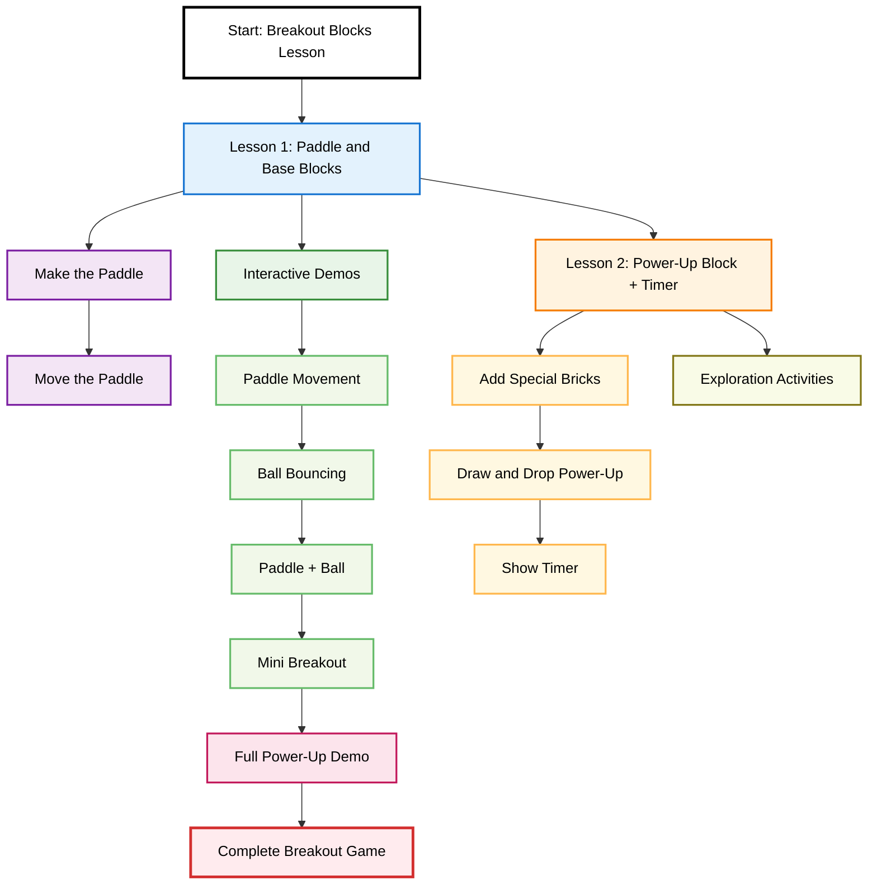

## Lesson Objectives:
  - Explore the structure and progression of Breakout game levels
  - Analyze point systems and scoring logic
  - Implement level transitions and checkpoints
  - Integrate interactive demos for level mechanics
  - Practice designing fair and engaging game progression
  - Visualize lesson flow with diagrams and code samples

<br>

### [👉 Click this for full source code](https://github.com/code259/curators/tree/main/hacks/breakout)


## **Lesson 1: Paddle and Base Blocks**

**Goal:** Learn how to move a rectangle across the canvas and understand basic drawing and input handling.

### Step 1: Make the paddle

We draw a rectangle at the bottom of the canvas.  

```js
let paddleHeight = 10;
let basePaddleWidth = 75;
let paddleWidth = basePaddleWidth;
let paddleX = (canvas.width - paddleWidth) / 2;

function drawPaddle() {
  ctx.beginPath();
  ctx.rect(paddleX, canvas.height - paddleHeight, paddleWidth, paddleHeight);
  ctx.fillStyle = "#0095DD";
  ctx.fill();
  ctx.closePath();
}
```

<!-- ===== THEORY QUIZ — Lesson 1 • after Step 1 (Pastel blue, all text black) ===== -->
<section style="clear:both;">
  <div id="quiz-s1" style="max-width:820px;margin:16px auto;padding:12px;border:2px solid #1976d2;border-radius:10px;background:#e3f2fd;box-sizing:border-box;font-family:system-ui,Arial;color:#000;">
    <h4 style="margin:0 0 8px 0;color:#000;">✅ Theory Check (after Step 1)</h4>

    <p style="margin:6px 0;color:#000;">1) In an HTML5 Canvas, where is the origin <code>(0,0)</code> located?</p>
    <label style="color:#000;"><input type="radio" name="s1_q1" value="topLeft"> Top-left corner</label><br>
    <label style="color:#000;"><input type="radio" name="s1_q1" value="center"> Center</label><br>
    <label style="color:#000;"><input type="radio" name="s1_q1" value="bottomLeft"> Bottom-left corner</label>

    <p style="margin:10px 0 6px;color:#000;">2) Which call starts a new vector drawing path?</p>
    <label style="color:#000;"><input type="radio" name="s1_q2" value="beginPath"> <code>ctx.beginPath()</code></label><br>
    <label style="color:#000;"><input type="radio" name="s1_q2" value="newPath"> <code>ctx.newPath()</code></label><br>
    <label style="color:#000;"><input type="radio" name="s1_q2" value="start"> <code>ctx.start()</code></label>

    <p style="margin:10px 0 6px;color:#000;">3) Which signature correctly defines a rectangle on Canvas?</p>
    <label style="color:#000;"><input type="radio" name="s1_q3" value="rect"> <code>ctx.rect(x, y, width, height)</code></label><br>
    <label style="color:#000;"><input type="radio" name="s1_q3" value="box"> <code>ctx.box(width, height, x, y)</code></label><br>
    <label style="color:#000;"><input type="radio" name="s1_q3" value="rect2"> <code>rect(x, y)</code></label>

    <div style="margin-top:10px;display:flex;gap:8px;">
      <button class="quiz-check" data-quiz="quiz-s1"
        data-answers='{"s1_q1":"topLeft","s1_q2":"beginPath","s1_q3":"rect"}'
        style="padding:6px 10px;border:1px solid #1976d2;background:#fff;color:#000;border-radius:8px;cursor:pointer;">
        Check answers
      </button>
      <button class="quiz-reset" data-quiz="quiz-s1"
        style="padding:6px 10px;border:1px solid #1976d2;background:#fff;color:#000;border-radius:8px;cursor:pointer;">
        Reset
      </button>
    </div>
    <div class="quiz-feedback" style="margin-top:8px;font-weight:600;color:#000;"></div>
  </div>
</section>

---

### Step 2: Move the paddle

We listen for keyboard input and update the paddleX position.

```js
let rightPressed = false;
let leftPressed = false;

document.addEventListener("keydown", keyDownHandler);
document.addEventListener("keyup", keyUpHandler);

function keyDownHandler(e) {
  if (e.key === "Right" || e.key === "ArrowRight") rightPressed = true;
  else if (e.key === "Left" || e.key === "ArrowLeft") leftPressed = true;
}

function keyUpHandler(e) {
  if (e.key === "Right" || e.key === "ArrowRight") rightPressed = false;
  else if (e.key === "Left" || e.key === "ArrowLeft") leftPressed = false;
}

function updatePaddle() {
  if (rightPressed && paddleX < canvas.width - paddleWidth) paddleX += 7;
  else if (leftPressed && paddleX > 0) paddleX -= 7;
}
```

**Explore:**

* Change speed and observe responsiveness.
* Try switching keys; how does it affect UX?

<!-- ===== THEORY QUIZ — Lesson 1 • after Step 2 (Pastel purple, all text black) ===== -->
<section style="clear:both;">
  <div id="quiz-s2" style="max-width:820px;margin:16px auto;padding:12px;border:2px solid #7b1fa2;border-radius:10px;background:#f3e5f5;box-sizing:border-box;font-family:system-ui,Arial;color:#000;">
    <h4 style="margin:0 0 8px 0;color:#000;">✅ Theory Check (after Step 2)</h4>

    <p style="margin:6px 0;color:#000;">1) What best describes <em>event-driven programming</em> in this context?</p>
    <label style="color:#000;"><input type="radio" name="s2_q1" value="events"> Code reacts to user/input events like key presses</label><br>
    <label style="color:#000;"><input type="radio" name="s2_q1" value="loopOnly"> Code runs only in a tight while-loop without events</label><br>
    <label style="color:#000;"><input type="radio" name="s2_q1" value="compile"> Code that only runs at compile time</label>

    <p style="margin:10px 0 6px;color:#000;">2) Why track both <code>keydown</code> and <code>keyup</code>?</p>
    <label style="color:#000;"><input type="radio" name="s2_q2" value="held"> To know if a key is currently held for continuous input</label><br>
    <label style="color:#000;"><input type="radio" name="s2_q2" value="color"> To change drawing colors</label><br>
    <label style="color:#000;"><input type="radio" name="s2_q2" value="oneShot"> To capture only one-shot taps</label>

    <p style="margin:10px 0 6px;color:#000;">3) The boundary checks on <code>paddleX</code> illustrate which concept?</p>
    <label style="color:#000;"><input type="radio" name="s2_q3" value="clamp"> Clamping values to a valid range</label><br>
    <label style="color:#000;"><input type="radio" name="s2_q3" value="recursion"> Recursion</label><br>
    <label style="color:#000;"><input type="radio" name="s2_q3" value="hoist"> Hoisting</label>

    <div style="margin-top:10px;display:flex;gap:8px;">
      <button class="quiz-check" data-quiz="quiz-s2"
        data-answers='{"s2_q1":"events","s2_q2":"held","s2_q3":"clamp"}'
        style="padding:6px 10px;border:1px solid #7b1fa2;background:#fff;color:#000;border-radius:8px;cursor:pointer;">
        Check answers
      </button>
      <button class="quiz-reset" data-quiz="quiz-s2"
        style="padding:6px 10px;border:1px solid #7b1fa2;background:#fff;color:#000;border-radius:8px;cursor:pointer;">
        Reset
      </button>
    </div>
    <div class="quiz-feedback" style="margin-top:8px;font-weight:600;color:#000;"></div>
  </div>
</section>

---

## **Lesson 2: Power-Up Block + Timer**

**Goal:** Use arrays/objects to model state, randomness to vary behavior, and time to manage temporary effects.

### Step 1: Add special bricks that drop a power-up when broken.

* We randomly give some bricks a powerUp property:

```js
let bricks = [];
const powerUpChance = 0.3; // 30% chance
for (let c = 0; c < brickColumnCount; c++) {
  bricks[c] = [];
  for (let r = 0; r < brickRowCount; r++) {
    const hasPowerUp = Math.random() < powerUpChance;
    bricks[c][r] = { x: 0, y: 0, status: 1, powerUp: hasPowerUp };
  }
}
```

When a power-up brick is hit, it spawns a falling power-up:
```js
if (b.powerUp) {
  powerUps.push({ x: b.x + brickWidth/2, y: b.y, active: true });
}
```

<!-- ===== THEORY QUIZ — Lesson 2 • Step 1 (Pastel yellow, all text black) ===== -->
<section style="clear:both;">
  <div id="quiz-l2s1" style="max-width:820px;margin:16px auto;padding:12px;border:2px solid #ffb74d;border-radius:10px;background:#fff8e1;box-sizing:border-box;font-family:system-ui,Arial;color:#000;">
    <h4 style="margin:0 0 8px 0;color:#000;">✅ Theory Check (L2 • Step 1)</h4>

    <p style="margin:6px 0;color:#000;">1) In an array like <code>bricks[c][r]</code>, what do <code>c</code> and <code>r</code> typically represent?</p>
    <label style="color:#000;"><input type="radio" name="l2s1_q1" value="grid"> Column and row indices in a grid</label><br>
    <label style="color:#000;"><input type="radio" name="l2s1_q1" value="color"> Color and radius</label><br>
    <label style="color:#000;"><input type="radio" name="l2s1_q1" value="remainder"> Remainder and count</label>

    <p style="margin:10px 0 6px;color:#000;">2) The expression <code>Math.random() &lt; p</code> models:</p>
    <label style="color:#000;"><input type="radio" name="l2s1_q2" value="bernoulli"> A Bernoulli trial with probability <code>p</code></label><br>
    <label style="color:#000;"><input type="radio" name="l2s1_q2" value="rounding"> A rounding technique</label><br>
    <label style="color:#000;"><input type="radio" name="l2s1_q2" value="sorting"> A sorting comparison</label>

    <p style="margin:10px 0 6px;color:#000;">3) Using objects like <code>{x, y, status, powerUp}</code> is an example of:</p>
    <label style="color:#000;"><input type="radio" name="l2s1_q3" value="composition"> Modeling state via object composition</label><br>
    <label style="color:#000;"><input type="radio" name="l2s1_q3" value="inheritance"> Class inheritance</label><br>
    <label style="color:#000;"><input type="radio" name="l2s1_q3" value="memo"> Memoization</label>

    <div style="margin-top:10px;display:flex;gap:8px;">
      <button class="quiz-check" data-quiz="quiz-l2s1"
        data-answers='{"l2s1_q1":"grid","l2s1_q2":"bernoulli","l2s1_q3":"composition"}'
        style="padding:6px 10px;border:1px solid #ffb74d;background:#fff;color:#000;border-radius:8px;cursor:pointer;">
        Check answers
      </button>
      <button class="quiz-reset" data-quiz="quiz-l2s1"
        style="padding:6px 10px;border:1px solid #ffb74d;background:#fff;color:#000;border-radius:8px;cursor:pointer;">
        Reset
      </button>
    </div>
    <div class="quiz-feedback" style="margin-top:8px;font-weight:600;color:#000;"></div>
  </div>
</section>

---

### Step 2: Draw and drop the power-up

* Each power-up is drawn and updated per animation frame.

```js
let powerUps = [];
let activePowerUp = null;
let powerUpTimer = 0;
const powerUpDuration = 5000; // 5 seconds

function drawPowerUps() {
  for (let p of powerUps) {
    if (p.active) {
      ctx.beginPath();
      ctx.arc(p.x, p.y, 10, 0, Math.PI * 2);
      ctx.fillStyle = "gold";
      ctx.fill();
      ctx.closePath();

      ctx.fillStyle = "black";
      ctx.font = "bold 14px Arial";
      ctx.textAlign = "center";
      ctx.fillText("P", p.x, p.y);

      // per-frame update (basic Euler integration)
      p.y += 1.5;

      // basic AABB hit test against the paddle rectangle
      if (p.y >= canvas.height - paddleHeight &&
          p.x > paddleX && p.x < paddleX + paddleWidth) {
        p.active = false;
        activePowerUp = "Wide Paddle";
        powerUpTimer = Date.now();
      }
    }
  }
}
```

<!-- ===== THEORY QUIZ — Lesson 2 • Step 2 (Pastel orange, all text black) ===== -->
<section style="clear:both;">
  <div id="quiz-l2s2" style="max-width:820px;margin:16px auto;padding:12px;border:2px solid #f57c00;border-radius:10px;background:#fff3e0;box-sizing:border-box;font-family:system-ui,Arial;color:#000;">
    <h4 style="margin:0 0 8px 0;color:#000;">✅ Theory Check (L2 • Step 2)</h4>

    <p style="margin:6px 0;color:#000;">1) Updating position each frame by adding a velocity is an example of:</p>
    <label style="color:#000;"><input type="radio" name="l2s2_q1" value="euler"> Per-frame incremental update (Euler-style)</label><br>
    <label style="color:#000;"><input type="radio" name="l2s2_q1" value="binary"> Binary search</label><br>
    <label style="color:#000;"><input type="radio" name="l2s2_q1" value="tail"> Tail recursion</label>

    <p style="margin:10px 0 6px;color:#000;">2) Why must shapes/text be redrawn every animation frame on Canvas?</p>
    <label style="color:#000;"><input type="radio" name="l2s2_q2" value="immediate"> Canvas is immediate-mode; previous frame pixels aren’t retained semantically</label><br>
    <label style="color:#000;"><input type="radio" name="l2s2_q2" value="auto"> The browser automatically preserves and animates shapes</label><br>
    <label style="color:#000;"><input type="radio" name="l2s2_q2" value="css"> CSS repaints vectors for us each frame</label>

    <p style="margin:10px 0 6px;color:#000;">3) Checking if a point lies within a rectangle is called:</p>
    <label style="color:#000;"><input type="radio" name="l2s2_q3" value="aabb"> AABB (axis-aligned bounding box) hit testing</label><br>
    <label style="color:#000;"><input type="radio" name="l2s2_q3" value="dijkstra"> Dijkstra’s algorithm</label><br>
    <label style="color:#000;"><input type="radio" name="l2s2_q3" value="fft"> Fast Fourier Transform</label>

    <div style="margin-top:10px;display:flex;gap:8px;">
      <button class="quiz-check" data-quiz="quiz-l2s2"
        data-answers='{"l2s2_q1":"euler","l2s2_q2":"immediate","l2s2_q3":"aabb"}'
        style="padding:6px 10px;border:1px solid #f57c00;background:#fff;color:#000;border-radius:8px;cursor:pointer;">
        Check answers
      </button>
      <button class="quiz-reset" data-quiz="quiz-l2s2"
        style="padding:6px 10px;border:1px solid #f57c00;background:#fff;color:#000;border-radius:8px;cursor:pointer;">
        Reset
      </button>
    </div>
    <div class="quiz-feedback" style="margin-top:8px;font-weight:600;color:#000;"></div>
  </div>
</section>

---

### Step 3: Show timer

* Draw the time left on screen.

```js
function drawPowerUpTimer() {
  if (activePowerUp) {
    let elapsed = Date.now() - powerUpTimer;
    let remaining = Math.max(0, powerUpDuration - elapsed);

    // Draw bar
    ctx.fillStyle = "gray";
    ctx.fillRect(canvas.width - 20, 20, 10, 100);

    ctx.fillStyle = "lime";
    let fillHeight = (remaining / powerUpDuration) * 100;
    ctx.fillRect(canvas.width - 20, 120 - fillHeight, 10, fillHeight);

    if (remaining <= 0) {
      activePowerUp = null;
      paddleWidth = basePaddleWidth; // reset
    }
  }
}
```

**Explore:**
* Make the timer 10 seconds instead of 5.
* Try different effects (ex: double player speed).

<!-- ===== THEORY QUIZ — Lesson 2 • Step 3 (Pastel pink, all text black) ===== -->
<section style="clear:both;">
  <div id="quiz-l2s3" style="max-width:820px;margin:16px auto;padding:12px;border:2px solid #c2185b;border-radius:10px;background:#fce4ec;box-sizing:border-box;font-family:system-ui,Arial;color:#000;">
    <h4 style="margin:0 0 8px 0;color:#000;">✅ Theory Check (L2 • Step 3)</h4>

    <p style="margin:6px 0;color:#000;">1) A countdown visual that maps remaining time to a bar height is an example of:</p>
    <label style="color:#000;"><input type="radio" name="l2s3_q1" value="linear"> Linear normalization (mapping [0,duration] → [0,pixels])</label><br>
    <label style="color:#000;"><input type="radio" name="l2s3_q1" value="hash"> Hashing</label><br>
    <label style="color:#000;"><input type="radio" name="l2s3_q1" value="graphql"> GraphQL query</label>

    <p style="margin:10px 0 6px;color:#000;">2) Why use <code>Math.max(0, remaining)</code> before drawing?</p>
    <label style="color:#000;"><input type="radio" name="l2s3_q2" value="clamp0"> To clamp negative time to 0 and avoid inverted bars</label><br>
    <label style="color:#000;"><input type="radio" name="l2s3_q2" value="faster"> To make the timer faster</label><br>
    <label style="color:#000;"><input type="radio" name="l2s3_q2" value="random"> To randomize the bar height</label>

    <p style="margin:10px 0 6px;color:#000;">3) Resetting the paddle when the timer ends demonstrates:</p>
    <label style="color:#000;"><input type="radio" name="l2s3_q3" value="lifecycle"> Effect lifecycle management (start → active → end/cleanup)</label><br>
    <label style="color:#000;"><input type="radio" name="l2s3_q3" value="memo"> Memoization</label><br>
    <label style="color:#000;"><input type="radio" name="l2s3_q3" value="deadlock"> Deadlock prevention</label>

    <div style="margin-top:10px;display:flex;gap:8px;">
      <button class="quiz-check" data-quiz="quiz-l2s3"
        data-answers='{"l2s3_q1":"linear","l2s3_q2":"clamp0","l2s3_q3":"lifecycle"}'
        style="padding:6px 10px;border:1px solid #c2185b;background:#fff;color:#000;border-radius:8px;cursor:pointer;">
        Check answers
      </button>
      <button class="quiz-reset" data-quiz="quiz-l2s3"
        style="padding:6px 10px;border:1px solid #c2185b;background:#fff;color:#000;border-radius:8px;cursor:pointer;">
        Reset
      </button>
    </div>
    <div class="quiz-feedback" style="margin-top:8px;font-weight:600;color:#000;"></div>
  </div>
</section>

<hr/>

<h2>Interactive Demos Progression</h2>
<h4>Until base functionality - does not include advanced features</h4>
<h4>Use the right and left arrows to move the breaker.</h4>

<h3>1. Paddle Movement</h3>

<!-- Toggle -->
<label style="display:block; text-align:center; margin:6px 0;">
  <input type="checkbox" id="toggle-paddle"> Show code
</label>

<!-- Canvas wrapper (shown by default) -->
<div id="wrap-paddle">
  <!-- Canvas 1: Paddle Movement -->

  <canvas id="paddleDemo" width="300" height="150" style="background:white; border:2px solid #333; display:block; margin:0 auto;"></canvas>

  <script>
  const pdCanvas = document.getElementById("paddleDemo");
  const pdCtx = pdCanvas.getContext("2d");
  let pdX = (pdCanvas.width - 75) / 2;
  let pdRight = false, pdLeft = false;

  document.addEventListener("keydown", e => {
    if (e.key === "ArrowRight") pdRight = true;
    if (e.key === "ArrowLeft") pdLeft = true;
  });
  document.addEventListener("keyup", e => {
    if (e.key === "ArrowRight") pdRight = false;
    if (e.key === "ArrowLeft") pdLeft = false;
  });

  function drawPaddleDemo() {
    pdCtx.clearRect(0,0,pdCanvas.width,pdCanvas.height);
    pdCtx.fillStyle = "#0095DD";
    pdCtx.fillRect(pdX, pdCanvas.height-10, 75, 10);
    if (pdRight && pdX < pdCanvas.width-75) pdX += 5;
    if (pdLeft && pdX > 0) pdX -= 5;
    requestAnimationFrame(drawPaddleDemo);
  }
  drawPaddleDemo();
  </script>
</div>

<!-- Read-only code view (hidden by default) -->
<pre id="code-paddle" style="display:none; max-width:820px; margin:8px auto; overflow:auto;"><code>&lt;!-- Canvas 1: Paddle Movement --&gt;
&lt;h3&gt;1. Paddle Movement&lt;/h3&gt;
&lt;canvas id="paddleDemo" width="300" height="150" style="background:white; border:2px solid #333; display:block; margin:0 auto;"&gt;&lt;/canvas&gt;

&lt;script&gt;
const pdCanvas = document.getElementById("paddleDemo");
const pdCtx = pdCanvas.getContext("2d");
let pdX = (pdCanvas.width - 75) / 2;
let pdRight = false, pdLeft = false;

document.addEventListener("keydown", e =&gt; {
  if (e.key === "ArrowRight") pdRight = true;
  if (e.key === "ArrowLeft") pdLeft = true;
});
document.addEventListener("keyup", e =&gt; {
  if (e.key === "ArrowRight") pdRight = false;
  if (e.key === "ArrowLeft") pdLeft = false;
});

function drawPaddleDemo() {
  pdCtx.clearRect(0,0,pdCanvas.width,pdCanvas.height);
  pdCtx.fillStyle = "#0095DD";
  pdCtx.fillRect(pdX, pdCanvas.height-10, 75, 10);
  if (pdRight &amp;&amp; pdX &lt; pdCanvas.width-75) pdX += 5;
  if (pdLeft &amp;&amp; pdX &gt; 0) pdX -= 5;
  requestAnimationFrame(drawPaddleDemo);
}
drawPaddleDemo();
&lt;/script&gt;
</code></pre>

<!-- Tiny toggle wiring for Canvas 1 -->
<script>
(function(){
  const toggle = document.getElementById("toggle-paddle");
  const wrap = document.getElementById("wrap-paddle");
  const code = document.getElementById("code-paddle");

  // default: unchecked → canvas visible
  toggle.checked = false;

  toggle.addEventListener("change", () => {
    if (toggle.checked) {
      wrap.style.display = "none";
      code.style.display = "block";
    } else {
      code.style.display = "none";
      wrap.style.display = "block";
    }
  });
})();
</script>

<!-- ========================= Canvas 2 ========================= -->
<h3>2. Ball Bouncing</h3>
<label style="display:block; text-align:center; margin:6px 0;">
  <input type="checkbox" id="toggle-ball"> Show code
</label>

<div id="wrap-ball">
  <!-- Canvas 2: Ball Bouncing -->
  <canvas id="ballDemo" width="300" height="150" style="background:white; border:2px solid #333; display:block; margin:0 auto;"></canvas>

  <script>
  const bCanvas = document.getElementById("ballDemo");
  const bCtx = bCanvas.getContext("2d");
  let bx = bCanvas.width/2, by = bCanvas.height/2, bvx = 2, bvy = 2, br = 8;

  function drawBallDemo() {
    bCtx.clearRect(0,0,bCanvas.width,bCanvas.height);
    bCtx.beginPath();
    bCtx.arc(bx, by, br, 0, Math.PI*2);
    bCtx.fillStyle = "#DD0000";
    bCtx.fill();
    bCtx.closePath();
    bx += bvx; by += bvy;
    if (bx+br > bCanvas.width || bx-br < 0) bvx = -bvx;
    if (by+br > bCanvas.height || by-br < 0) bvy = -bvy;
    requestAnimationFrame(drawBallDemo);
  }
  drawBallDemo();
  </script>
</div>

<pre id="code-ball" style="display:none; max-width:820px; margin:8px auto; overflow:auto;"><code>&lt;!-- Canvas 2: Ball Bouncing --&gt;
&lt;h3&gt;2. Ball Bouncing&lt;/h3&gt;
&lt;canvas id="ballDemo" width="300" height="150" style="background:white; border:2px solid #333; display:block; margin:0 auto;"&gt;&lt;/canvas&gt;

&lt;script&gt;
const bCanvas = document.getElementById("ballDemo");
const bCtx = bCanvas.getContext("2d");
let bx = bCanvas.width/2, by = bCanvas.height/2, bvx = 2, bvy = 2, br = 8;

function drawBallDemo() {
  bCtx.clearRect(0,0,bCanvas.width,bCanvas.height);
  bCtx.beginPath();
  bCtx.arc(bx, by, br, 0, Math.PI*2);
  bCtx.fillStyle = "#DD0000";
  bCtx.fill();
  bCtx.closePath();
  bx += bvx; by += bvy;
  if (bx+br &gt; bCanvas.width || bx-br &lt; 0) bvx = -bvx;
  if (by+br &gt; bCanvas.height || by-br &lt; 0) bvy = -bvy;
  requestAnimationFrame(drawBallDemo);
}
drawBallDemo();
&lt;/script&gt;
</code></pre>

<script>
(function(){
  const toggle = document.getElementById("toggle-ball");
  const wrap = document.getElementById("wrap-ball");
  const code = document.getElementById("code-ball");
  toggle.checked = false;
  toggle.addEventListener("change", () => {
    if (toggle.checked) { wrap.style.display = "none"; code.style.display = "block"; }
    else { code.style.display = "none"; wrap.style.display = "block"; }
  });
})();
</script>

<!-- ========================= Canvas 3 ========================= -->
<h3>3. Paddle + Ball</h3>
<label style="display:block; text-align:center; margin:6px 0;">
  <input type="checkbox" id="toggle-combo"> Show code
</label>

<div id="wrap-combo">
  <!-- Canvas 3: Paddle + Ball -->
  <canvas id="comboDemo" width="300" height="150" style="background:white; border:2px solid #333; display:block; margin:0 auto;"></canvas>

  <script>
  const cCanvas = document.getElementById("comboDemo");
  const cCtx = cCanvas.getContext("2d");
  let cx = cCanvas.width/2, cy = cCanvas.height-30, cvx = 2, cvy = -2, cr = 8;
  let cpX = (cCanvas.width - 75)/2, cRight = false, cLeft = false;

  document.addEventListener("keydown", e => {
    if (e.key === "ArrowRight") cRight = true;
    if (e.key === "ArrowLeft") cLeft = true;
  });
  document.addEventListener("keyup", e => {
    if (e.key === "ArrowRight") cRight = false;
    if (e.key === "ArrowLeft") cLeft = false;
  });

  function drawCombo() {
    cCtx.clearRect(0,0,cCanvas.width,cCanvas.height);
    // Ball
    cCtx.beginPath();
    cCtx.arc(cx, cy, cr, 0, Math.PI*2);
    cCtx.fillStyle = "#DD0000";
    cCtx.fill();
    cCtx.closePath();
    // Paddle
    cCtx.fillStyle = "#0095DD";
    cCtx.fillRect(cpX, cCanvas.height-10, 75, 10);
    // Update ball
    cx += cvx; cy += cvy;
    if (cx+cr > cCanvas.width || cx-cr < 0) cvx = -cvx;
    if (cy-cr < 0) cvy = -cvy;
    else if (cy+cr > cCanvas.height-10 && cx > cpX && cx < cpX+75) cvy = -cvy;
    else if (cy+cr > cCanvas.height) { cx = cCanvas.width/2; cy = cCanvas.height/2; }
    // Update paddle
    if (cRight && cpX < cCanvas.width-75) cpX += 5;
    if (cLeft && cpX > 0) cpX -= 5;
    requestAnimationFrame(drawCombo);
  }
  drawCombo();
  </script>
</div>

<pre id="code-combo" style="display:none; max-width:820px; margin:8px auto; overflow:auto;"><code>&lt;!-- Canvas 3: Paddle + Ball --&gt;
&lt;h3&gt;3. Paddle + Ball&lt;/h3&gt;
&lt;canvas id="comboDemo" width="300" height="150" style="background:white; border:2px solid #333; display:block; margin:0 auto;"&gt;&lt;/canvas&gt;

&lt;script&gt;
const cCanvas = document.getElementById("comboDemo");
const cCtx = cCanvas.getContext("2d");
let cx = cCanvas.width/2, cy = cCanvas.height-30, cvx = 2, cvy = -2, cr = 8;
let cpX = (cCanvas.width - 75)/2, cRight = false, cLeft = false;

document.addEventListener("keydown", e =&gt; {
  if (e.key === "ArrowRight") cRight = true;
  if (e.key === "ArrowLeft") cLeft = true;
});
document.addEventListener("keyup", e =&gt; {
  if (e.key === "ArrowRight") cRight = false;
  if (e.key === "ArrowLeft") cLeft = false;
});

function drawCombo() {
  cCtx.clearRect(0,0,cCanvas.width,cCanvas.height);
  // Ball
  cCtx.beginPath();
  cCtx.arc(cx, cy, cr, 0, Math.PI*2);
  cCtx.fillStyle = "#DD0000";
  cCtx.fill();
  cCtx.closePath();
  // Paddle
  cCtx.fillStyle = "#0095DD";
  cCtx.fillRect(cpX, cCanvas.height-10, 75, 10);
  // Update ball
  cx += cvx; cy += cvy;
  if (cx+cr &gt; cCanvas.width || cx-cr &lt; 0) cvx = -cvx;
  if (cy-cr &lt; 0) cvy = -cvy;
  else if (cy+cr &gt; cCanvas.height-10 &amp;&amp; cx &gt; cpX &amp;&amp; cx &lt; cpX+75) cvy = -cvy;
  else if (cy+cr &gt; cCanvas.height) { cx = cCanvas.width/2; cy = cCanvas.height/2; }
  // Update paddle
  if (cRight &amp;&amp; cpX &lt; cCanvas.width-75) cpX += 5;
  if (cLeft &amp;&amp; cpX &gt; 0) cpX -= 5;
  requestAnimationFrame(drawCombo);
}
drawCombo();
&lt;/script&gt;
</code></pre>

<script>
(function(){
  const toggle = document.getElementById("toggle-combo");
  const wrap = document.getElementById("wrap-combo");
  const code = document.getElementById("code-combo");
  toggle.checked = false;
  toggle.addEventListener("change", () => {
    if (toggle.checked) { wrap.style.display = "none"; code.style.display = "block"; }
    else { code.style.display = "none"; wrap.style.display = "block"; }
  });
})();
</script>

<!-- ========================= Canvas 4 ========================= -->
<h3>4. Mini Breakout (Ball + Paddle + Bricks)</h3>
<label style="display:block; text-align:center; margin:6px 0;">
  <input type="checkbox" id="toggle-breakout"> Show code
</label>

<div id="wrap-breakout">
  <!-- Canvas 4: Full Mini Breakout -->
  <canvas id="breakoutDemo" width="300" height="200" style="background:white; border:2px solid #333; display:block; margin:0 auto;"></canvas>

  <script>
  const brCanvas = document.getElementById("breakoutDemo");
  const brCtx = brCanvas.getContext("2d");
  // Ball
  let brX = brCanvas.width/2, brY = brCanvas.height-30, brVX = 2, brVY = -2, brR = 8;
  // Paddle
  let brPW = 75, brPH = 10, brPX = (brCanvas.width-brPW)/2, brRight = false, brLeft = false;
  // Bricks
  const rowCount=3, colCount=5, bw=50, bh=15, bp=10, bo=30, bt=30;
  let bricks = [];
  for(let c=0;c<colCount;c++){ bricks[c]=[]; for(let r=0;r<rowCount;r++){ bricks[c][r]={x:0,y:0,status:1}; } }

  document.addEventListener("keydown",e=>{ if(e.key==="ArrowRight")brRight=true; if(e.key==="ArrowLeft")brLeft=true; });
  document.addEventListener("keyup",e=>{ if(e.key==="ArrowRight")brRight=false; if(e.key==="ArrowLeft")brLeft=false; });

  function drawBricks() {
    for(let c=0;c<colCount;c++){ for(let r=0;r<rowCount;r++){
      if(bricks[c][r].status==1){
        let bx=(c*(bw+bp))+bo, by=(r*(bh+bp))+bt;
        bricks[c][r].x=bx; bricks[c][r].y=by;
        brCtx.fillStyle="#00AA00";
        brCtx.fillRect(bx,by,bw,bh);
      }
    }}
  }

  function drawBreakout() {
    brCtx.clearRect(0,0,brCanvas.width,brCanvas.height);
    // Ball
    brCtx.beginPath(); brCtx.arc(brX,brY,brR,0,Math.PI*2); brCtx.fillStyle="#DD0000"; brCtx.fill(); brCtx.closePath();
    // Paddle
    brCtx.fillStyle="#0095DD"; brCtx.fillRect(brPX, brCanvas.height-brPH, brPW, brPH);
    // Bricks
    drawBricks();
    // Collision
    for(let c=0;c<colCount;c++){ for(let r=0;r<rowCount;r++){
      let b=bricks[c][r];
      if(b.status==1 && brX> b.x && brX< b.x+bw && brY> b.y && brY< b.y+bh){
        brVY=-brVY; b.status=0;
      }
    }}
    // Ball move
    brX+=brVX; brY+=brVY;
    if(brX+brR>brCanvas.width||brX-brR<0) brVX=-brVX;
    if(brY-brR<0) brVY=-brVY;
    else if(brY+brR>brCanvas.height-brPH && brX>brPX && brX<brPX+brPW) brVY=-brVY;
    else if(brY+brR>brCanvas.height){ brX=brCanvas.width/2; brY=brCanvas.height-30; brVY=-2; }
    // Paddle move
    if(brRight && brPX<brCanvas.width-brPW) brPX+=5;
    if(brLeft && brPX>0) brPX-=5;
    requestAnimationFrame(drawBreakout);
  }
  drawBreakout();
  </script>
</div>

<pre id="code-breakout" style="display:none; max-width:820px; margin:8px auto; overflow:auto;"><code>&lt;!-- Canvas 4: Full Mini Breakout --&gt;
&lt;h3&gt;4. Mini Breakout (Ball + Paddle + Bricks)&lt;/h3&gt;
&lt;canvas id="breakoutDemo" width="300" height="200" style="background:white; border:2px solid #333; display:block; margin:0 auto;"&gt;&lt;/canvas&gt;

&lt;script&gt;
const brCanvas = document.getElementById("breakoutDemo");
const brCtx = brCanvas.getContext("2d");
// Ball
let brX = brCanvas.width/2, brY = brCanvas.height-30, brVX = 2, brVY = -2, brR = 8;
// Paddle
let brPW = 75, brPH = 10, brPX = (brCanvas.width-brPW)/2, brRight = false, brLeft = false;
// Bricks
const rowCount=3, colCount=5, bw=50, bh=15, bp=10, bo=30, bt=30;
let bricks = [];
for(let c=0;c&lt;colCount;c++){ bricks[c]=[]; for(let r=0;r&lt;rowCount;r++){ bricks[c][r]={x:0,y:0,status:1}; } }

document.addEventListener("keydown",e=&gt;{ if(e.key==="ArrowRight")brRight=true; if(e.key==="ArrowLeft")brLeft=true; });
document.addEventListener("keyup",e=&gt;{ if(e.key==="ArrowRight")brRight=false; if(e.key==="ArrowLeft")brLeft=false; });

function drawBricks() {
  for(let c=0;c&lt;colCount;c++){ for(let r=0;r&lt;rowCount;r++){
    if(bricks[c][r].status==1){
      let bx=(c*(bw+bp))+bo, by=(r*(bh+bp))+bt;
      bricks[c][r].x=bx; bricks[c][r].y=by;
      brCtx.fillStyle="#00AA00";
      brCtx.fillRect(bx,by,bw,bh);
    }
  }}
}

function drawBreakout() {
  brCtx.clearRect(0,0,brCanvas.width,brCanvas.height);
  // Ball
  brCtx.beginPath(); brCtx.arc(brX,brY,brR,0,Math.PI*2); brCtx.fillStyle="#DD0000"; brCtx.fill(); brCtx.closePath();
  // Paddle
  brCtx.fillStyle="#0095DD"; brCtx.fillRect(brPX, brCanvas.height-brPH, brPW, brPH);
  // Bricks
  drawBricks();
  // Collision
  for(let c=0;c&lt;colCount;c++){ for(let r=0;r&lt;rowCount;r++){
    let b=bricks[c][r];
    if(b.status==1 &amp;&amp; brX&gt; b.x &amp;&amp; brX&lt; b.x+bw &amp;&amp; brY&gt; b.y &amp;&amp; brY&lt; b.y+bh){
      brVY=-brVY; b.status=0;
    }
  }}
  // Ball move
  brX+=brVX; brY+=brVY;
  if(brX+brR&gt;brCanvas.width||brX-brR&lt;0) brVX=-brVX;
  if(brY-brR&lt;0) brVY=-brVY;
  else if(brY+brR&gt;brCanvas.height-brPH &amp;&amp; brX&gt;brPX &amp;&amp; brX&lt;brPX+brPW) brVY=-brVY;
  else if(brY+brR&gt;brCanvas.height){ brX=brCanvas.width/2; brY=brCanvas.height-30; brVY=-2; }
  // Paddle move
  if(brRight &amp;&amp; brPX&lt;brCanvas.width-brPW) brPX+=5;
  if(brLeft &amp;&amp; brPX&gt;0) brPX-=5;
  requestAnimationFrame(drawBreakout);
}
drawBreakout();
&lt;/script&gt;
</code></pre>

<script>
(function(){
  const toggle = document.getElementById("toggle-breakout");
  const wrap = document.getElementById("wrap-breakout");
  const code = document.getElementById("code-breakout");
  toggle.checked = false;
  toggle.addEventListener("change", () => {
    if (toggle.checked) { wrap.style.display = "none"; code.style.display = "block"; }
    else { code.style.display = "none"; wrap.style.display = "block"; }
  });
})();
</script>

<!-- ========================= QUIZ FIXES (place once at end) ========================= -->
<style>
  /* Force readable black text inside all quiz cards, regardless of theme */
  [id^="quiz-"] {
    color:#000 !important;
    opacity:1 !important;
    filter:none !important;
    text-shadow:none !important;
    -webkit-text-fill-color:#000;
  }
  [id^="quiz-"] * {
    color:#000 !important;
    -webkit-text-fill-color:#000;
  }
  [id^="quiz-"] code {
    color:#000 !important;
    background:#eee !important;
    padding:0 6px;
    border-radius:6px;
  }
  [id^="quiz-"] button {
    color:#000 !important;
    background:#fff !important;
    border:1px solid currentColor !important;
    border-radius:8px;
    padding:6px 10px;
    cursor:pointer;
  }
</style>

<script>
(function(){
  // Ensure quiz buttons never submit a form
  document.querySelectorAll('.quiz-check, .quiz-reset').forEach(b => b.setAttribute('type','button'));

  function getAnswers(btn){
    try { return JSON.parse(btn.getAttribute('data-answers') || "{}"); }
    catch (e) { return {}; }
  }

  function check(root, answers){
    let correct = 0, total = 0, missing = [];
    for (const [name, val] of Object.entries(answers)){
      total++;
      const picked = root.querySelector('input[name="'+name+'"]:checked');
      if (!picked) { missing.push(name); continue; }
      if (picked.value === val) correct++;
    }
    const fb = root.querySelector('.quiz-feedback');
    if (!fb) return;
    if (missing.length){
      fb.textContent = "Answer all questions before checking.";
      fb.style.color = "#000";
      return;
    }
    fb.textContent = (correct === total)
      ? `Great job! Score: ${correct}/${total}`
      : `Keep going! Score: ${correct}/${total} (review the code above)`;
    fb.style.color = "#000";
  }

  function reset(root){
    root.querySelectorAll('input[type="radio"]').forEach(r => r.checked = false);
    const fb = root.querySelector('.quiz-feedback');
    if (fb){ fb.textContent = ""; fb.style.color = "#000"; }
  }

  // Robust delegated click handler (works for clicks on inner text, spans, etc.)
  document.addEventListener('click', function(e){
    const checkBtn = e.target.closest('.quiz-check');
    if (checkBtn){
      e.preventDefault();
      const root = document.getElementById(checkBtn.getAttribute('data-quiz'));
      if (root) check(root, getAnswers(checkBtn));
      return;
    }
    const resetBtn = e.target.closest('.quiz-reset');
    if (resetBtn){
      e.preventDefault();
      const root = document.getElementById(resetBtn.getAttribute('data-quiz'));
      if (root) reset(root);
    }
  }, true);
})();
</script>
