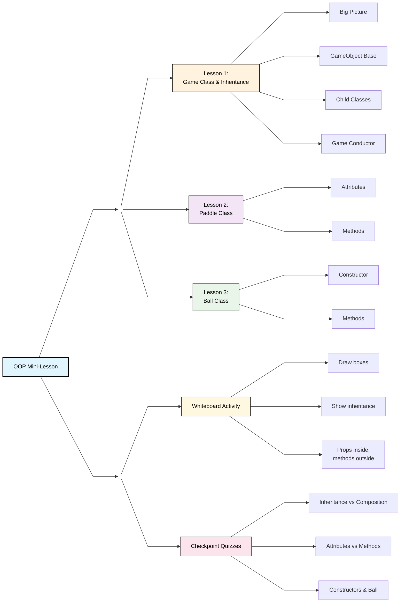

<link
   rel="stylesheet"
   href="https://cdn.jsdelivr.net/npm/rippleui@1.12.1/dist/css/styles.css"
/>

<h1 class="hub-title">OOPs Breakout (3-Part Mini Lesson)</h1>

<a href="{{site.baseurl}}/hacks" style="text-decoration:none;color:#007acc;font-weight:bold;">Click here to go back to main page</a>

 

---

 

## Lesson Objectives:
  - Introduce object-oriented programming concepts in JavaScript
  - Explain the structure of the Breakout game using classes
  - Compare inheritance, composition, and encapsulation
  - Map game entities (Ball, Paddle, Brick, PowerUp) to class hierarchies
  - Discuss the role of the Game class as a coordinator
  - Prepare students for deeper OOP topics in subsequent lessons

	

		

			<h2 class="card-header">OOP Breakout: Lesson 1</h2>
			
The Game class & how inheritance works

			

				<a href="{{ site.baseurl }}/oopbreakoutlesson1"><button class="btn-secondary btn">Go to lesson →</button></a>
			

		

	

	

		

			<h2 class="card-header">OOP Breakout: Lesson 2</h2>
			
The Paddle class: attributes vs. methods

			

				<a href="{{ site.baseurl }}/oopbreakoutlesson2"><button class="btn-secondary btn">Go to lesson →</button></a>
			

		

	

	

		

			<h2 class="card-header">OOP Breakout: Lesson 3</h2>
			
The Ball class & constructors

			

				<a href="{{ site.baseurl }}/oopbreakoutlesson3"><button class="btn-secondary btn">Go to lesson →</button></a>
			

		

	

	

		

			<h2 class="card-header">OOP Breakout: Expert</h2>
			
*Very difficult extra game & lesson (not on mindmap!)

			

				<a href="{{ site.baseurl }}/oopadv"><button class="btn-secondary btn">Go to lesson →</button></a>
			

		

	

 

---

## ACTIVITY: Showcase your learning in the blackboard below. 
- Draw your “class” as a box → properties inside (like health, lives), methods outside (like move(), hitBrick()).
- Draw inheritance → a Paddle class, then draw a “PowerPaddle” subclass that has an extra feature (like shooting lasers).

 

<canvas id="c" width="680" height="500" style="border:1px solid #ccc"></canvas>

 
Press `r` to change brush color to red.
Press `b` to change brush color to blue.
Press `g` to change brush color to green.
Press `c` to clear blackboard. 

# ✅ Checkpoint Quizzes

  <!-- Quiz 1 -->
  

    
Lesson 1 Checkpoint

    
Inheritance vs. Composition

    

      
1) Which classes inherit from <code>GameObject</code>?

      <label class="option"><input type="checkbox" value="Ball">Ball</label>
      <label class="option"><input type="checkbox" value="Paddle">Paddle</label>
      <label class="option"><input type="checkbox" value="Game">Game</label>
      <label class="option"><input type="checkbox" value="Brick">Brick</label>
    

    

      
2) What is composition in the <code>Game</code> class?

      <label class="option"><input type="radio" name="q2">Game extends GameObject</label>
      <label class="option"><input type="radio" name="q2">Game owns and manages Ball, Paddle, Bricks</label>
      <label class="option"><input type="radio" name="q2">Game overrides draw()</label>
    

    <button class="check">Check Answers</button>
    <button class="clear">Clear</button>
    

  

  <!-- Quiz 2 -->
  

    
Lesson 2 Checkpoint

    
Attributes vs. Methods

    

      
1) Which of these are attributes of Paddle?

      <label class="option"><input type="checkbox" value="width">width</label>
      <label class="option"><input type="checkbox" value="color">color</label>
      <label class="option"><input type="checkbox" value="draw()">draw()</label>
      <label class="option"><input type="checkbox" value="update()">update()</label>
    

    

      
2) Which method makes the paddle respond to keyboard input?

      <label class="option"><input type="radio" name="q2p">reset()</label>
      <label class="option"><input type="radio" name="q2p">update()</label>
      <label class="option"><input type="radio" name="q2p">applyPowerUp()</label>
    

    <button class="check">Check Answers</button>
    <button class="clear">Clear</button>
    

  

  <!-- Quiz 3 -->
  

    
Lesson 3 Checkpoint

    
Constructors & Ball

    

      
1) What does <code>super(x, y)</code> do in Ball’s constructor?

      <label class="option"><input type="radio" name="q3a">Calls the Game class</label>
      <label class="option"><input type="radio" name="q3a">Calls GameObject constructor</label>
      <label class="option"><input type="radio" name="q3a">Sets speed to default</label>
    

    

      
2) What does <code>speedUp()</code> change?

      <label class="option"><input type="radio" name="q3b">Ball size only</label>
      <label class="option"><input type="radio" name="q3b">Velocity magnitude</label>
      <label class="option"><input type="radio" name="q3b">Direction and color</label>
    

    <button class="check">Check Answers</button>
    <button class="clear">Clear</button>
    

  

---

## Wrap-up: how the pieces fit

* **Inheritance:** `Ball`, `Paddle`, `Brick`, `PowerUp` extend `GameObject` to share position and override `draw/update`.&#x20;
* **Composition:** `Game` builds the world—instantiates objects, tracks score/lives/level, and runs the loop.&#x20;