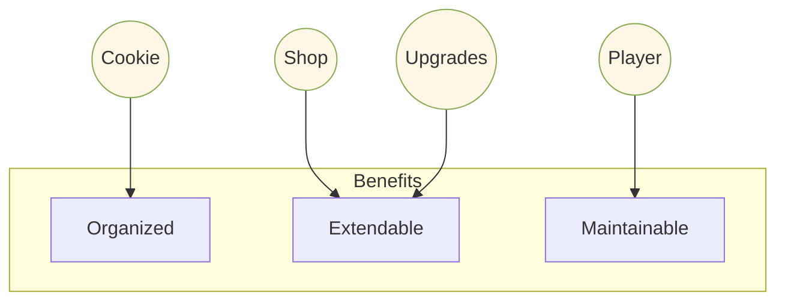
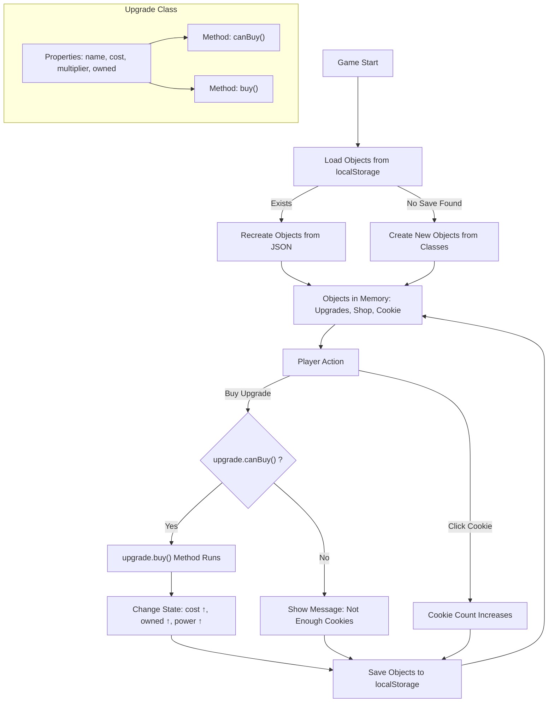

# Part 2 — 🧱 OOP (All object-oriented content)
### What is OOP?

**OOP (Object-Oriented Programming)** is a programming style focused on creating and interacting with **objects**. These objects model real-world things and have:
- **Properties**: Characteristics or data of the object (e.g., a car’s color, size, or speed).
- **Methods**: Actions the object can perform (e.g., a car can "drive" or "honk").

**Class**: A class is a **blueprint** for creating objects. It defines the properties and methods that the objects will have. A class is just a plan; when you create an object from it, the object is what you interact with.

In short, OOP organizes and writes code by grouping related data and actions into **objects** and using **classes** to define how they behave.

---

### What Does "Object-Oriented" Mean?

"Object-Oriented" means programming is **centered around objects**. Instead of focusing on separate data and functions, OOP combines both into **objects**, which are self-contained units with their own data and actions.

- **Object**: Like a real-world object, it has **properties** (data) and **methods** (functions). For example, a car object might have properties like `color` and `speed`, and methods like `drive()` or `honk()`.
  
- **Oriented**: This means the code is **focused on** objects. In OOP, objects are the main building blocks of the program. The code is mostly about creating and interacting with objects, rather than just using separate functions to manipulate data.

So, **Object-Oriented** programming is all about building programs around objects, where data and actions are tightly connected.

### Why Use Object-Oriented Programming?

- **Organization**: It makes code easier to manage and understand by breaking complex systems into smaller, independent objects.
- **Reusability**: Once an object (or class) is defined, it can be reused to create multiple objects without rewriting code.
- **Maintainability**: Changes to one object are isolated, so you don’t risk breaking other parts of the program when updating or adding features.
- **Scalability**: OOP allows programs to grow more easily by adding new objects and behaviors without getting unmanageable.

```mermaid
flowchart LR
  OOP((OOP))
  O[Object]:::b -->|has| P[Properties (data)]:::g
  O -->|does| M[Methods (actions)]:::g
  C[Class (blueprint)]:::b -->|creates| O
  classDef b fill:#f0f0f0,stroke:#333,stroke-width:1px
  classDef g fill:#e8f6ff,stroke:#247,stroke-width:1px
```

### Why OOP in Cookie Clicker?
- Cookie, upgrades, shop, and player are all **objects**.
  - All of these objects can store data and perform actions.
    - For example, the Cookie object stores data of how many cookies there are, and also allows the user to add cookies when they perform different actions.
- OOP makes code **organized**, **extendable**, and **easier to maintain**.




#### Give one more example of an object in the code:
<input type="text" placeholder="Type here..."/>
<details>
<summary>More Objects</summary>
<br>
- gameLoop
<br>
- Each item in the shop is its own object

</details>


### OOP Concepts Used
- **Class** → e.g., `Upgrade`
- **Object (Instance)** → e.g., “Golden Cursor”
- **Properties** → `name`, `cost`, `multiplier`, `owned`
- **Methods** → `canBuy()`, `buy()`
- **Encapsulation** → each object manages its own data and logic

### Example Student Tasks
1. Make an `Upgrade` class with `name`, `cost`, `multiplier`, `owned`.
2. Add `canBuy()` and `buy()` with an **if statement** to check cost.
3. Create at least **two instances** (e.g., “Metal Spoon”, “Golden Cursor”).
4. (Tie-in with Part 1) Save & load these objects with localStorage.

```mermaid
mindmap
  root((OOP in Cookie Clicker))
    Class
      Upgrade
      EmojiBuddy
    Object_Instance
      "Golden Cursor"
      "Metal Spoon"
    Properties
      name
      cost
      multiplier
      owned
    Methods
      canBuy()
      buy()
      animate()
    Encapsulation
      "data + logic inside each object"
```


---

### Example of OOP in the Game

Here is an example of how we implemented OOP (Object-Oriented Programming) in Cookie Clicker.  
The `EmojiBuddy` class is responsible for creating and animating emojis that bounce around the game area whenever items are purchased.


```js
class EmojiBuddy {
  /**
   * velocity on the y axis
   * @type {number}
   */
  dy = 2;
  /**
   * velocity on the x axis
   * @type {number}
   */
  dx = 2;
  /**
   *
   * @param {string} emoji
   */
  constructor(emoji) {
    this.emojiString = emoji;
    this.animate = this.animate.bind(this);
  }
}
```


