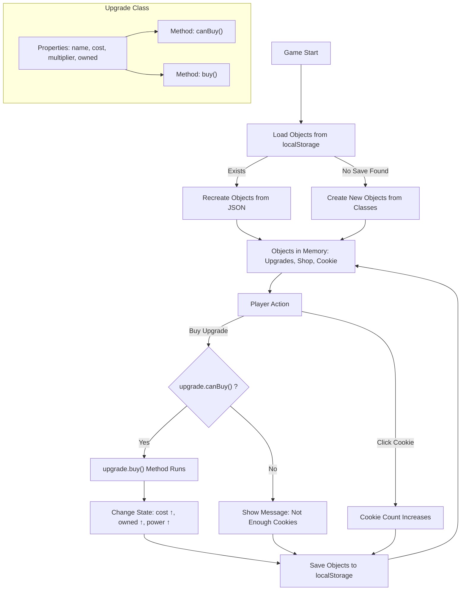

# Part 2 — 🧱 OOP (All object-oriented content)

### What is OOP?
- **OOP** = Object-Oriented Programming.
- **Object**: thing with **properties** (data) + **methods** (actions).
- **Class**: a **blueprint** that defines what objects look like.

### Why OOP in Cookie Clicker?
- Cookie, upgrades, shop, and player are all **objects**.
- OOP makes code **organized**, **extendable**, and **easier to maintain**.

### OOP Concepts Used
- **Class** → e.g., `Upgrade`
- **Object (Instance)** → e.g., “Golden Cursor”
- **Properties** → `name`, `cost`, `multiplier`, `owned`
- **Methods** → `canBuy()`, `buy()`
- **Encapsulation** → each object manages its own data and logic

### Example Student Tasks
1. Make an `Upgrade` class with `name`, `cost`, `multiplier`, `owned`.
2. Add `canBuy()` and `buy()` with an **if statement** to check cost.
3. Create at least **two instances** (e.g., “Metal Spoon”, “Golden Cursor”).
4. (Tie-in with Part 1) Save & load these objects with localStorage.

---

### Example of OOP in the Game

Here is an example of how we implemented OOP (Object-Oriented Programming) in Cookie Clicker.  
The `EmojiBuddy` class is responsible for creating and animating emojis that bounce around the game area whenever items are purchased.


```js
class EmojiBuddy {
  /**
   * velocity on the y axis
   * @type {number}
   */
  dy = 2;
  /**
   * velocity on the x axis
   * @type {number}
   */
  dx = 2;
  /**
   *
   * @param {string} emoji
   */
  constructor(emoji) {
    this.emojiString = emoji;
    this.animate = this.animate.bind(this);
  }
}
```


