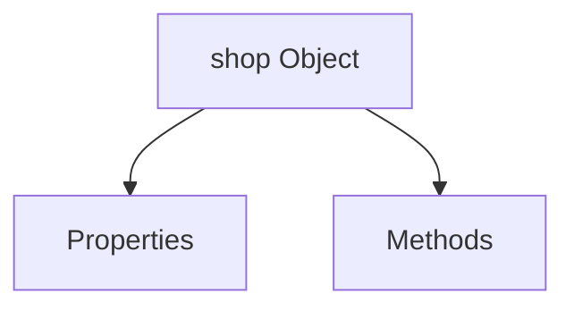
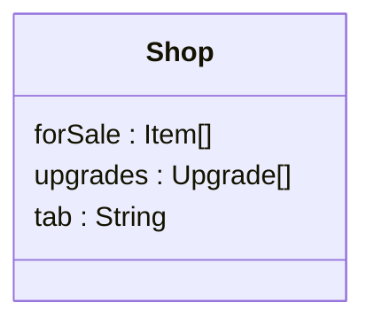
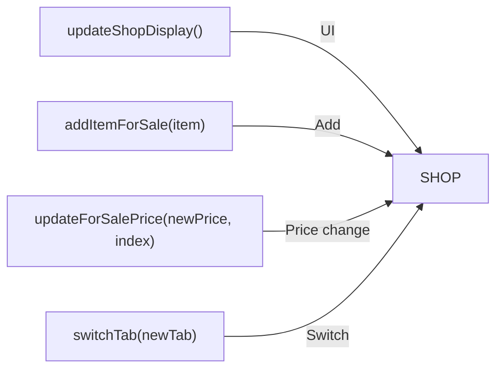
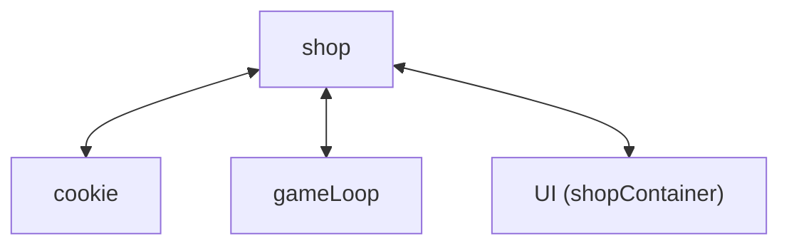
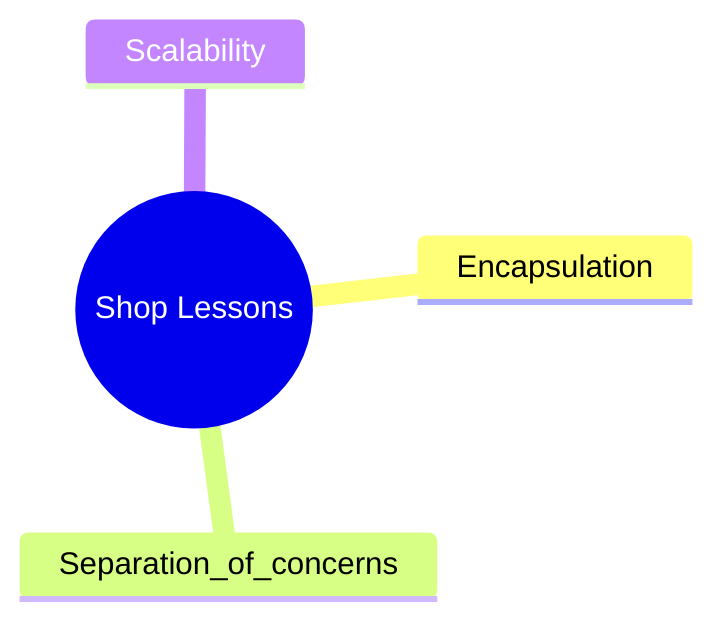
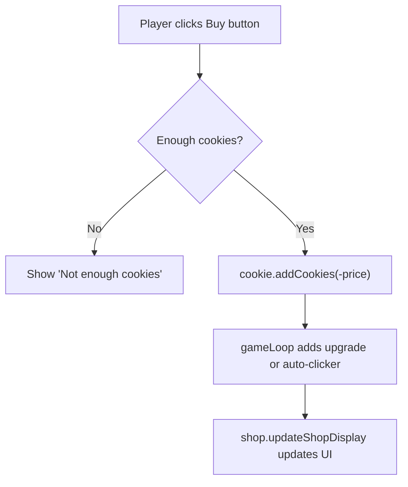

# Lesson: Understanding the Shop Object

## 1. What is the `shop`?

---

## 2. Properties
In the cookie clicker game, the shop has the following properties:
- `forSale` → list of items you can buy (like Grandma or Factory)
- `upgrades` → special one-time boosts (like 2X clicks)
- `tab` → tells the shop whether to show “Shop” items or “Upgrades”

Properties are like the memory of the object.

---

## 3. Methods
The shop also runs functions:
- `updateShopDisplay()` → rebuilds the shop UI on screen
- `addItemForSale(item)` → adds an item to the list
- `updateForSalePrice(newPrice, index)` → raises the price after you buy something
- `switchTab(newTab)` → switches between “Shop” and “Upgrades”

Methods are the actions the object knows how to perform.

---

## 4. How it Connects to Other Parts
The shop doesn’t work alone. It connects to:
- `cookie` object → checks if you have enough cookies and deducts the cost
- `gameLoop` object → gives you auto-clickers or upgrades when you buy
- UI (`shopContainer`) → updates the buttons the player sees

This makes the shop a hub that ties together money, gameplay, and visuals.

---

## 5. What You Can Learn From It
- Encapsulation → All shop logic is inside one object, so the code is organized
- Separation of concerns → Shop only handles buying and displaying; cookies and gameLoop handle their own jobs
- Scalability → You can add new items or upgrades without rewriting the whole shop

---
#### Take a guess on how the code works, where do the purchased shopItems go to?
Type the answer (including the object it is stored in (Hint: Its in gameLoop)):  
<input id="checkInput" type="text" placeholder="Type here..."
       style="padding:6px;border:1px solid #ccc;border-radius:6px;" />

Answer:

 
- If it’s an upgrade (like 2x clicks), it goes to **gameLoop.upgrades**  
 
- If it’s an autoclicker (like a grandma), it goes to **gameLoop.autoClickers**

## Takeaway
When learning JavaScript and object-oriented design, notice how each object in your game has a clear role. By keeping properties and methods grouped, your code becomes easier to read, expand, and debug.

