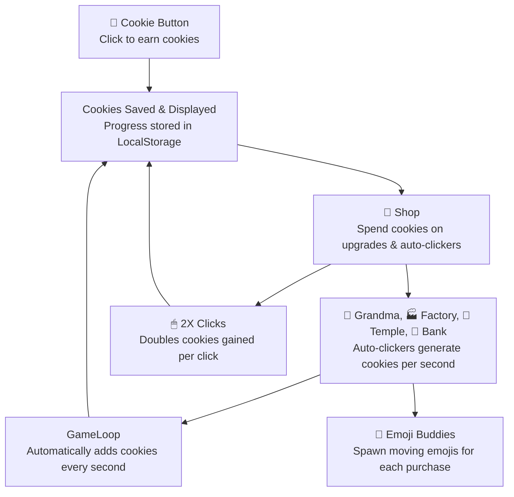
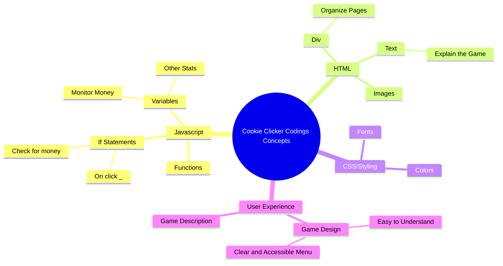
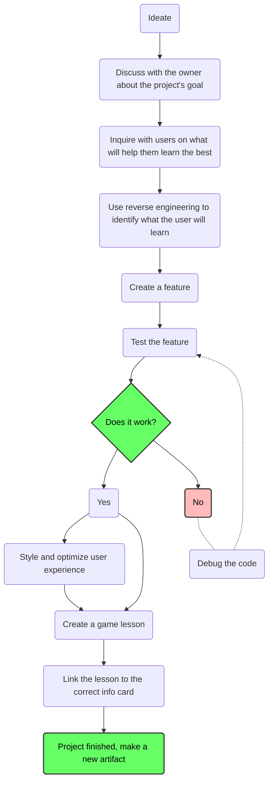
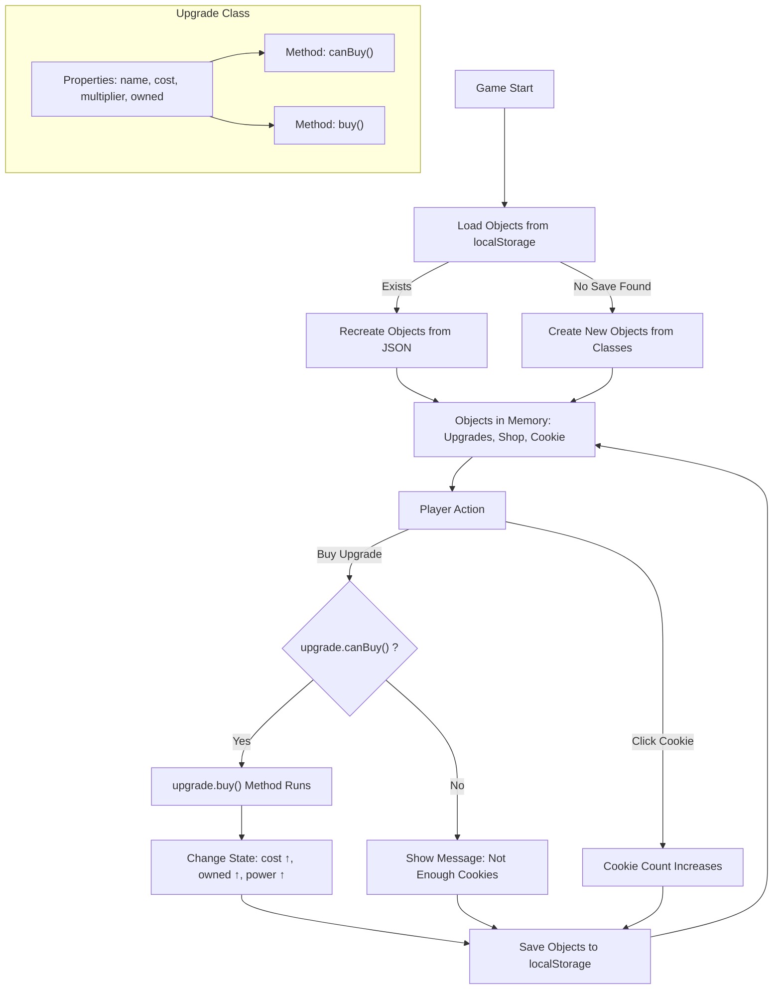

# Cookie Clicker – Feature Add-On Assignment

### Group 1

| Role            | Name                 | GitHub |
|:---------------:|:--------------------:|:------:|
| 🧭 Scrum Master | **Kush Shah**        | [GitHub](https://github.com/kush1434) |
| 📋 Assistant Scrum | **Trevor Vick**   | [GitHub](https://github.com/Tvick22) |
| 💻 Engineer     | Elliot Yang          | [GitHub](https://github.com/ellioty15) |

### Group 2

| Role            | Name                 | GitHub |
|:---------------:|:--------------------:|:------:|
| 💻 Engineer     | Travis Callow        | [Github](https://github.com/TravisCallow) |
| 💻 Engineer     | Aranya Bhattacharya  | [GitHub](https://github.com/aranyab0924) |
| 💻 Engineer     | Alex Rubio           | [GitHub](https://github.com/AlexRubio1) |

We already have a working Cookie Clicker game. Right now, the game lets you click on the cookie to increase your score. That’s cool, but pretty basic. Your job is to **add a new feature** to make the game more fun and complex.

This will give you practice with:
- Writing and reusing **methods**
- Keeping code organized in the right files
- Using **if statements** to control when something happens
- Storing and loading game data with **localStorage**

## Steps to Add Your Feature

  
Click to view steps

  

### Strategic Group of 3
Work together in groups of three to plan, design, and test your addition.

### Step 1 – Evaluate the Game
Play the current Cookie Clicker version to understand what features already exist, how cookies accumulate, and what feels missing or repetitive.

### Step 2 – Brainstorm New Ideas
Discuss possible additions as a group. Use the example ideas provided (new shop item, superpower, unlockable, or visual change) as inspiration, or come up with your own creative twist.

### Step 3 – Define Your Feature
See flowchart below for current workflow example. Decide on your chosen feature and write a clear one-sentence description of what it does.

### Step 4 – Design & Implement
Add any new buttons, text, or visuals if your feature needs them.  
Write at least one **method** to make your feature work.  

### Step 5 – Save with localStorage
If your feature should persist after refreshing, integrate **localStorage** to save its state.

### Step 6 – Test and Refine
Run the game to check if your feature works as expected. Fix any issues, refine the design, and polish the user experience. Once everything is finalized, add your feature to the mermaid chart.

  

# Mindmap/guide for creating a game, considering the goal of teaching

---

---

## localStorage

Normally when you refresh a webpage, everything resets — all your cookies would go back to zero.
localStorage is a way for the browser to save data on your computer so it stays even after you refresh.

You will need to use localStorage so your feature can **save progress**. For example, if you buy an item in the shop, it should still be there after you reload the page.

**Your job**: Go look at how localStorage is used in the code that’s already written. Figure out how it works and then apply it to your own feature.

---

## Your Task – Add a New Feature

Choose one feature to add to the game. Be creative, but make sure it includes:
- At least one **function**
- An **if statement** to check conditions
- Code placed in the correct file
- Use of **localStorage** if your feature needs to be saved

### Example Ideas
- New Shop Item: e.g., an upgrade that costs cookies and increases click power.
- Superpower: e.g., a button that gives a burst of cookies but only if you have enough to activate it.
- Unlockable: a special item that only appears after reaching a certain number of cookies.
- Visual Change: the cookie or background changes after hitting a milestone.

---

## Steps to Add Your Feature

1. Decide on your feature idea and describe it in one sentence.
2. Add any new buttons or text if your feature needs them.
3. Write a **function** that makes the feature work.
4. Use an **if statement** so the feature only works under the right conditions.
5. Use **localStorage** to save the state of your feature if needed.
6. Test your feature to make sure it works as expected.

---

## What to Turn In

- Your updated files.
- A short explanation (2–3 sentences) of what feature you added and how it works.

---

# OOP Lesson

We’ve already learned how to add new **features** with functions, if statements, and localStorage. Now let’s take it a step further and learn about **Object-Oriented Programming (OOP)**.

---

## What is OOP?

OOP stands for **Object-Oriented Programming**.  

It’s a way of coding where you think about things in your program as **objects**.  
- An **object** is like a “thing” that has **properties** (data) and **methods** (actions it can do).  
- A **class** is like a blueprint or recipe to make those objects.  

Think about the real world:  
- A **cookie** is an object (it has a size, a flavor, a number).  
- A **shop item** is an object (it has a cost, a name, and something it does).  
- A **player** is also an object (they have cookies, upgrades, and power).  

With OOP, instead of writing lots of separate functions and variables, we **bundle them together** so they belong to one object.  

---

## Why OOP in Cookie Clicker?

Cookie Clicker is a great example of OOP because almost everything in the game can be thought of as an object:  
- The **cookie** object keeps track of how many cookies you have.  
- The **upgrade** objects know their cost, effect, and how many you own.  
- The **shop** can be an object that manages all the upgrades.  

This makes the game easier to build, easier to add new features, and much more organized.

---

## OOP Concepts in Cookie Clicker

- **Class** → A blueprint. Example: `Upgrade` describes what all upgrades should have.  
- **Object (Instance)** → A real thing you can use. Example: “Golden Cursor Upgrade” created from the `Upgrade` class.  
- **Properties (Attributes)** → Variables that belong to an object. Example: `cost`, `multiplier`, `owned`.  
- **Methods** → Functions that belong to an object. Example: `buy()` checks cost and applies the upgrade.  
- **Encapsulation** → Each object manages its own data and actions. You don’t need to rewrite `buy()` for every single upgrade.  
- **Persistence with localStorage** → Save and load objects so your upgrades stay after refreshing.

---

## Example Student Tasks

1. Make an `Upgrade` class for shop items.  
2. Give it properties like `name`, `cost`, `multiplier`, and `owned`.  
3. Add a `buy()` method that uses an **if statement** to check if you have enough cookies.  
4. Create at least **two objects** (like “Metal Spoon” and “Golden Cursor”) from the class.  
5. Save and load these objects with **localStorage**.

---

## OOP in Cookie Clicker
