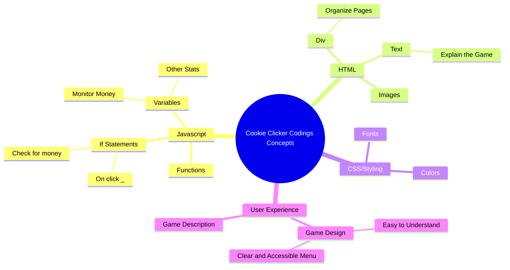

# Cookie Clicker – Feature Add-On Assignment  

We already have a working Cookie Clicker game. Right now, the game lets you click on the cookie to increase your score. That’s cool, but pretty basic. Your job is to **add a new feature** to make the game more fun and complex.  

This will give you practice with:  
- Writing and reusing **functions**  
- Keeping code organized in the right files  
- Using **if statements** to control when something happens  
- Storing and loading game data with **localStorage**  

---

---

## localStorage  

Normally when you refresh a webpage, everything resets — all your cookies would go back to zero.  
localStorage is a way for the browser to save data on your computer so it stays even after you refresh.  

You will need to use localStorage so your feature can **save progress**. For example, if you buy an item in the shop, it should still be there after you reload the page.  

**Your job**: Go look at how localStorage is used in the code that’s already written. Figure out how it works and then apply it to your own feature.  

---

## Your Task – Add a New Feature  

Choose one feature to add to the game. Be creative, but make sure it includes:  
- At least one **function**  
- An **if statement** to check conditions  
- Code placed in the correct file  
- Use of **localStorage** if your feature needs to be saved  

### Example Ideas  
- New Shop Item: e.g., an upgrade that costs cookies and increases click power.  
- Superpower: e.g., a button that gives a burst of cookies but only if you have enough to activate it.  
- Unlockable: a special item that only appears after reaching a certain number of cookies.  
- Visual Change: the cookie or background changes after hitting a milestone.  

---

## Steps to Add Your Feature  

1. Decide on your feature idea and describe it in one sentence.  
2. Add any new buttons or text if your feature needs them.  
3. Write a **function** that makes the feature work.  
4. Use an **if statement** so the feature only works under the right conditions.  
5. Use **localStorage** to save the state of your feature if needed.  
6. Test your feature to make sure it works as expected.  

---

## What to Turn In  

- Your updated files.  
- A short explanation (2–3 sentences) of what feature you added and how it works.  

---

## Reflection Questions  

1. What was the hardest part of adding your feature?  
2. Did using functions make your code easier to understand?  
3. How did if statements help control the logic?  
4. How did you use localStorage in your feature?  
5. If you had another hour, what would you add next?  
