# Cookie Clicker – Feature Add-On Assignment

### Group 1

| Role            | Name                 | GitHub |
|:---------------:|:--------------------:|:------:|
| 🧭 Scrum Master | **Kush Shah**        | [GitHub](https://github.com/kush1434) |
| 📋 Assistant Scrum | **Trevor Vick**   | [GitHub](https://github.com/Tvick22) |
| 💻 Engineer     | Elliot Yang          | [GitHub](https://github.com/ellioty15) |

### Group 2

| Role            | Name                 | GitHub |
|:---------------:|:--------------------:|:------:|
| 💻 Engineer     | Travis Callow        | [Github](https://github.com/TravisCallow) |
| 💻 Engineer     | Aranya Bhattacharya  | [GitHub](https://github.com/aranyab0924) |
| 💻 Engineer     | Alex Rubio           | [GitHub](https://github.com/AlexRubio1) |

We already have a working Cookie Clicker game. Right now, the game lets you click on the cookie to increase your score. That’s cool, but pretty basic. Your job is to **add a new feature** to make the game more fun and complex.

This will give you practice with:
- Writing and reusing **methods**
- Keeping code organized in the right files
- Using **if statements** to control when something happens
- Storing and loading game data with **localStorage**

## Steps to Add Your Feature

  
Click to view steps

  

### Strategic Group of 3
Work together in groups of three to plan, design, and test your addition.

### Step 1 – Evaluate the Game
Play the current Cookie Clicker version to understand what features already exist, how cookies accumulate, and what feels missing or repetitive.

### Step 2 – Brainstorm New Ideas
Discuss possible additions as a group. Use the example ideas provided (new shop item, superpower, unlockable, or visual change) as inspiration, or come up with your own creative twist.

### Step 3 – Define Your Feature
See flowchart below for current workflow example. Decide on your chosen feature and write a clear one-sentence description of what it does.

### Step 4 – Design & Implement
Add any new buttons, text, or visuals if your feature needs them.  
Write at least one **method** to make your feature work.  

### Step 5 – Save with localStorage
If your feature should persist after refreshing, integrate **localStorage** to save its state.

### Step 6 – Test and Refine
Run the game to check if your feature works as expected. Fix any issues, refine the design, and polish the user experience. Once everything is finalized, add your feature to the mermaid chart.

  

```mermaid
flowchart TD

    A[🍪 Cookie Button<br/>Click to earn cookies] --> B[Cookies Saved & Displayed<br/>Progress stored in LocalStorage]

    B --> C[🛒 Shop<br/>Spend cookies on upgrades & auto-clickers]

    C --> D[👵 Grandma, 🏭 Factory, 🥭 Temple, 🏦 Bank<br/>Auto-clickers generate cookies per second]
    C --> E[🖱 2X Clicks<br/>Doubles cookies gained per click]

    D --> F[GameLoop<br/>Automatically adds cookies every second]
    E --> B
    F --> B

    D --> G[🎉 Emoji Buddies<br/>Spawn moving emojis for each purchase]

```

# Mindmap/guide for creating a game, considering the goal of teaching

---

## Your Task – Add a New Feature

Choose one feature to add to the game. Be creative, but make sure it includes:
- At least one **function**
- An **if statement** to check conditions
- Code placed in the correct file
- Use of **localStorage** if your feature needs to be saved

### Example Ideas
- New Shop Item: e.g., an upgrade that costs cookies and increases click power.
- Superpower: e.g., a button that gives a burst of cookies but only if you have enough to activate it.
- Unlockable: a special item that only appears after reaching a certain number of cookies.
- Visual Change: the cookie or background changes after hitting a milestone.

---

## Steps to Add Your Feature

1. Decide on your feature idea and describe it in one sentence.
2. Add any new buttons or text if your feature needs them.
3. Write a **function** that makes the feature work.
4. Use an **if statement** so the feature only works under the right conditions.
5. Use **localStorage** to save the state of your feature if needed.
6. Test your feature to make sure it works as expected.

## Example Student Tasks

1. Make an `Upgrade` class for shop items.  
2. Give it properties like `name`, `cost`, `multiplier`, and `owned`.  
3. Add a `buy()` method that uses an **if statement** to check if you have enough cookies.  
4. Create at least **two objects** (like “Metal Spoon” and “Golden Cursor”) from the class.  
5. Save and load these objects with **localStorage**.
