# Cookie Clicker – Feature Add-On Assignment

### Created by...

| Role            | Name                 | GitHub |
|:---------------:|:--------------------:|:------:|
| 🧭 Scrum Master | Kush Shah        | [GitHub](https://github.com/kush1434) |
| 📋 Assistant Scrum | Trevor Vick   | [GitHub](https://github.com/Tvick22) |
| 💻 Engineer     | Elliot Yang          | [GitHub](https://github.com/ellioty15) |
| 💻 Engineer     | Travis Callow        | [Github](https://github.com/TravisCallow) |
| 💻 Engineer     | Aranya Bhattacharya  | [GitHub](https://github.com/aranyab0924) |
| 💻 Engineer     | Alex Rubio           | [GitHub](https://github.com/AlexRubio1) |

---

### Your job is to add a new feature that uses **Localstorage** (New upgrade, New currency, New Cookie Effects, etc.)

---

**This will give you practice with:**

- Writing and reusing **Javascript Object Methods**!
- File organization!
- Using **if statements**!
- Storing data with **localStorage**!

## BEFORE YOU START!

### Form a Group of 3
- Work together in groups of three to **plan, design, and test** your feature.
- **Your team only needs to submit one feature** all together (as long as you all worked on it)!

---

## How do I add a feature

### Step 1 – Play the game!
- Play Cookie Clicker
- Brainstorm as a group how you think the game works (With fancy coding terms)!

### Step 2 – What feature should we add?
- **AS A GROUP**, come up with your new feature to add to Cookie Clicker!
- This can be a visual change, but if you're ambitious, **add a technical change!**

### Step 3 – Finalize your feature...
- Write a clear one-sentence description (below) of exactly what it will do.

<input type="text" placeholder="Type here..."/>

### Step 4 – Design
- Add any new buttons, text, or visuals to support your feature!
- Add some new code to the game to make sure your feature works!

### Step 6 – Testing
- Run the game to see if your feature works as expected.
- Fix any issues and refine the design

---

## HACK 1

> Complete the OOP quiz on the 5th lesson and screenshot your score. You must recieve at least a 3/4 to get credit. Attatch that screenshot to a Github Issue.

<a href="{{site.baseurl}}/hacks/cookie-clicker/2025-08-29-collaboration.ipynb" download="collaboration.ipynb" class="bg-blue-500 hover:bg-blue-700 text-white font-bold py-2 px-4 rounded mt-4 inline-block">
  Download Collaboration Notebook
</a>

> Complete this collaboration notebook with your team of 3! (You can share the file on 1 computer if its easier) When completed, submit your notebook file (.ipynb) by attatching it to the same Github Issue as your quiz score screenshot. 

When both completed, each person must submit the link to their issue to the Cookie Clicker chat on slack. If you have any questions, contact **Kush Shah** or **Trevor Vick** on Slack.

---

```mermaid
flowchart TD

    A[🍪 Cookie Button<br/>Click to earn cookies] --> B[Cookies Saved & Displayed<br/>Progress stored in LocalStorage]

    B --> C[🛒 Shop<br/>Spend cookies on upgrades & auto-clickers]

    C --> D[👵 Grandma, 🏭 Factory, 🥭 Temple, 🏦 Bank<br/>Auto-clickers generate cookies per second]
    C --> E[🖱 2X Clicks<br/>Doubles cookies gained per click]

    D --> F[GameLoop<br/>Automatically adds cookies every second]
    E --> B
    F --> B

    D --> G[🎉 Emoji Buddies<br/>Spawn moving emojis for each purchase]

```

# Mindmap/guide for creating a game, considering the goal of teaching

---

---

## localStorage

- Localstorage is like a personal database for a webpage.
- It uses **KEY/VALUE** Pairs
  - **KEY: VALUE**
  - "Birth Year": 1967
  - "Vehicle Type": "Bus"
  - "Favorite Fruit": "Mango"

---

## Hack 2

## Your Task – Add a New Feature

Choose one feature to add to the game. Be creative, but make sure it includes:
- At least one **function**
- An **if statement** to check conditions
- Code placed in the correct file
- Use of **localStorage** if your feature needs to be saved

### Example Ideas
- New Shop Item: e.g., an upgrade that costs cookies and increases click power.
- Superpower: e.g., a button that gives a burst of cookies but only if you have enough to activate it.
- Unlockable: a special item that only appears after reaching a certain number of cookies.
- Visual Change: the cookie or background changes after hitting a milestone.

---

## Steps to Add Your Feature

1. Decide on your feature idea and describe it in one sentence.
2. Add any new buttons or text if your feature needs them.
3. Write a **function** that makes the feature work.
4. Use an **if statement** so the feature only works under the right conditions.
5. Use **localStorage** to save the state of your feature if needed.
6. Test your feature to make sure it works as expected.

