# Part 1 — 🔒 localStorage (All persistence-related content)

### What is localStorage and why use it?
- localStorage saves data in the browser so progress **persists after refresh**.
- If you buy an item in the shop, it should **still be there** after reload.
- Your task: study how localStorage is used in existing code and **apply it to your feature**.

### Requirements
- If your feature should persist, **integrate localStorage**.
- Save on state changes (clicks, buys, upgrades) and **load on game start**.

### Steps (persistence-focused)
1. On load, attempt to **read saved state** from localStorage.
2. If found, **recreate state** from JSON; otherwise **initialize defaults**.
3. On every relevant update, **write** the new state back to localStorage.

---

### Example in Code

An example of this is:

```js
cookie.addCookies(-1 * forSaleItemInfo.price);
localStorage.setItem("cookies", this.cookies);
const storedCookies = Number(localStorage.getItem("cookies"));
```

```mermaid
flowchart TD
    A[🍪 Cookie Button<br/>Click to earn cookies] --> B[Cookies Saved & Displayed<br/>Progress stored in LocalStorage]
    B --> C[🛒 Shop<br/>Spend cookies on upgrades & auto-clickers]
    C --> D[👵 Grandma, 🏭 Factory, 🥭 Temple, 🏦 Bank<br/>Auto-clickers generate cookies per second]
    C --> E[🖱 2X Clicks<br/>Doubles cookies gained per click]
    D --> F[GameLoop<br/>Automatically adds cookies every second]
    E --> B
    F --> B
    D --> G[🎉 Emoji Buddies<br/>Spawn moving emojis for each purchase]
```



