# Part 1 — 🔒 localStorage (All persistence-related content)

### What is localStorage and why use it?
- localStorage saves data in the browser so progress stays even after the page is refreshed.
- If you buy an item in the shop, the upgrade will stay after reloading.
- Your task: study how localStorage is used in existing code and **apply it to your feature**.

### Requirements
- If your feature should persist, **integrate localStorage**.
- Save on state changes (clicks, buys, upgrades) and **load on game start**.

### Steps (persistence-focused)
1. On load, attempt to **read saved state** from localStorage.
2. If found, **recreate state** from JSON; otherwise **initialize defaults**.
3. On every relevant update, **write** the new state back to localStorage.

---

#### What would be stored in the local storage for the cookie clicker game?

<input id="checkInput" type="text" placeholder="Type here..."
       style="padding:6px;border:1px solid #ccc;border-radius:6px;" />

<script>
const field = document.getElementById("checkInput");
field.addEventListener("keydown", e => {
  if (e.key === "Enter") {
    const val = field.value.trim().toLowerCase();
    if (val === "cookies" || val === "autoclickers" || val === "upgrades") {
      field.style.borderColor = "green";
      field.style.backgroundColor = "#496e46ff"; // light green
    } else {
      field.style.borderColor = "red";
      field.style.backgroundColor = "#6b3c40ff"; // light red
    }
  }
});
</script>

<details>
<summary>Answer:</summary>
<br>
- Cookies
<br>
- Purchased Autoclickers and the Amount
<br>
- Purchased Upgrades
</details>

### Example in Code

An example of this is:

```js
cookie.addCookies(-1 * forSaleItemInfo.price);
// Subtract the cost of the item from the player's cookie total
// Multiplying by -1 turns the price into a negative number
localStorage.setItem("cookies", this.cookies);
// Save the updated cookie total into browser storage
// This ensures the value persists even after refreshing/reopening the game
const storedCookies = Number(localStorage.getItem("cookies"));
// Retrieve the saved cookie total from storage
// localStorage stores values as strings, so wrap it in Number() to use it for math
```

```mermaid
flowchart TD
    A[🍪 Cookie Button<br/>Click to earn cookies] --> B[Cookies Saved & Displayed<br/>Progress stored in LocalStorage]
    B --> C[🛒 Shop<br/>Spend cookies on upgrades & auto-clickers]
    C --> D[👵 Grandma, 🏭 Factory, 🥭 Temple, 🏦 Bank<br/>Auto-clickers generate cookies per second]
    C --> E[🖱 2X Clicks<br/>Doubles cookies gained per click]
    D --> F[GameLoop<br/>Automatically adds cookies every second]
    E --> B
    F --> B
    D --> G[🎉 Emoji Buddies<br/>Spawn moving emojis for each purchase]
```



