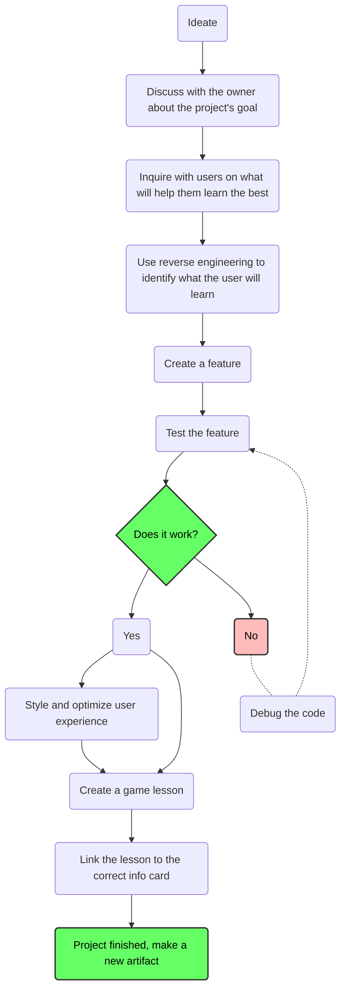

```mermaid
    flowchart
        A(Ideate)
        A --> B(Discuss with the owner about the project's goal)
        B --> C(Inquire with users on what will help them learn the best)
        C --> D(Use reverse engineering to identify what the user will learn)
        D --> E(Create a feature)
        E --> F(Test the feature)
        F --> G{Does it work?}
        G --> H(Yes)
        H --> I(Style and optimize user experience)
        I --> L
        G --> J(No)
        J -.- K(Debug the code)
        K -.-> F
        H --> L(Create a game lesson)
        L --> M(Link the lesson to the correct info card)
        M --> N(Project finished, make a new artifact)

    style G fill:#6f6,stroke:#333,stroke-width:2px,color:#000
    style J fill:#fbb,stroke:#333,stroke-width:2px,color:#000
    style N fill:#6f6,stroke:#333,stroke-width:2px,color:#000
```