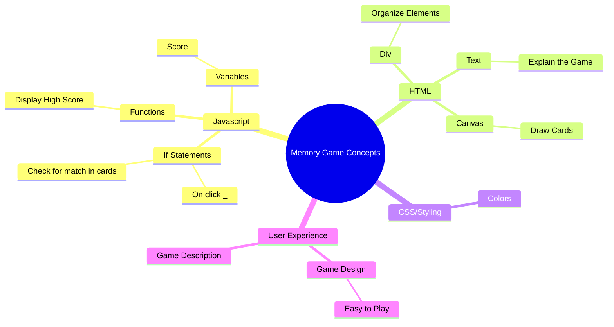

# Memory Game

| Role            | Name                 | GitHub |
|:---------------:|:--------------------:|:------:|
| 🧭 Lead Developer | **Torin Wolff**        | [GitHub](https://github.com/TDWolff) |

The Memory Game is a simple card matching game that helps improve memory and concentration skills. Players flip over cards to find matching pairs, testing their recall abilities. **Your assignment is to change the game by adding a personal highscore feature**.

This will give you practice with:
- Writing variables to local storage
- Creating functions to update and display the highscore
- Using conditionals to check and update the highscore

---

---

## localStorage

Normally when you refresh a webpage, everything resets — all your cookies would go back to zero.
localStorage is a way for the browser to save data on your computer so it stays even after you refresh.

You will need to use localStorage so your feature can **save data** such as a high score.

**Your job**: Look up how to use localStorage in JavaScript and use it to save a new high score feature.

---

## Your Task Overview

Try adding a new feature to the Memory Game that saves and displays a personal high score by keeping track of the least attempts to complete the game.

---

## Steps to Add Your Feature

1. Add the **highscore variable.**
2. Add a function to update the **highscore variable** based on attempts.
3. Write a **if statement** to compare if the current attempts are less than the saved highscore.
4. Write the lowest score to **localStorage**.
5. Test your feature to make sure it works as expected.

---

## What to Turn In/Show

- Your new updated game with the highscore feature.
- A short demo of the game with your new feature.
- A brief explanation of how you implemented the feature.
