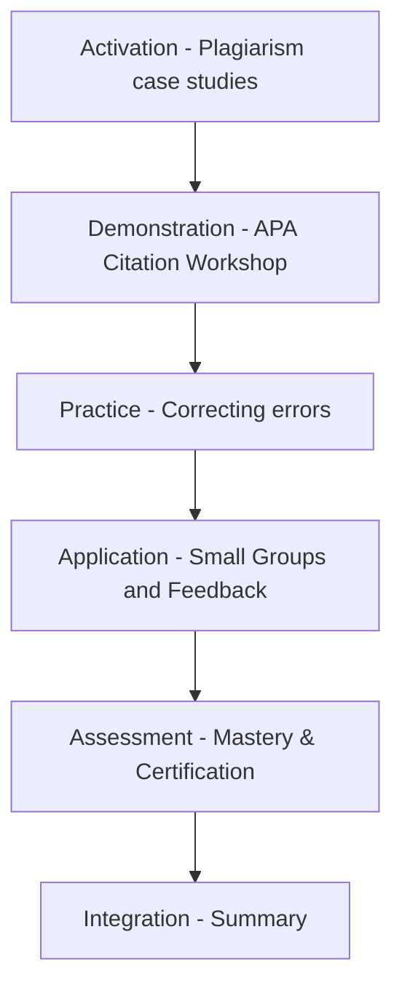

## Why Plagiarism Matters

Have you worked hours on a paper, or can you imagine doing so, only to fail because you are missing citation?  
❌ This could happen to you!

**Plagiarism = using someone else's words or ideas without giving proper credit.**

Creators use **symbols and licenses** to show ownership and how their work can be used:

- **© Copyright** → Protects books, articles, music, films  
- **™ Trademark** → Protects slogans and brands  
- **® Registered Trademark** → Legally registered brand ownership  
- **CC-BY-SA (Creative Commons)** → Allows sharing/adaptation with proper attribution  

---

## Overview

The goal of this workshop is to help you master the skills needed to create professional research papers using correct APA citation and reference standards. Through real-world plagiarism case studies, hands-on citation workshops, and collaborative group activities, you will learn to identify, correct, and properly format references. The process culminates in an assessment and certification of your citation skills.

---
