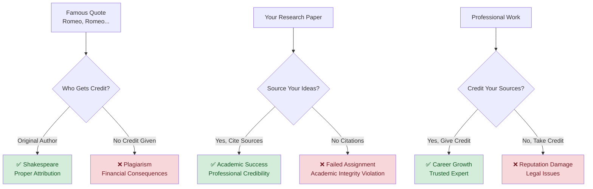
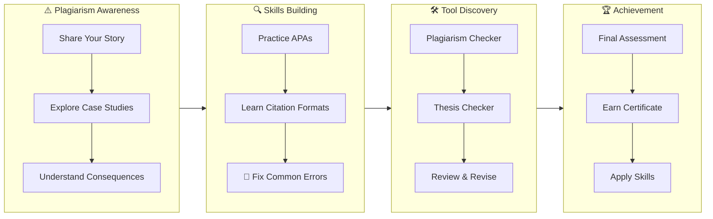

## The Power and Peril of Words

Literature has shaped culture and society through memorable phrases that continue to resonate today. For example, `"It was the best of times, it was the worst of times"` captures the contrasts of life in a way that still feels relevant. Another famous phrase, `"Romeo, Romeo, wherefore art thou Romeo?"` has been quoted in countless settings as a symbol of love and longing. Likewise, in film and popular culture, lines such as `"Frankly, my dear, I don't give a damn"` are recognized across generations.

**But what if someone claimed these words as their own?**

---

## From Inspiration to Citation Crisis

---

## Your Story Matters - Come Prepared

Create a sample story or paragraph that you can use at various times in this workshop! It is better if this example is in early stages and unrefined. The example paragraph on "Literature..." above is an example that needs workshop attention.

**Mindset preparation:** Before we begin, think of a time when:

- You worked really hard on something and someone else took credit
- You accidentally used someone's idea without giving credit
- You saw plagiarism happen in school, work, or online

*We'll need your sample and mindset throughout this workshop to make the learning personal and meaningful.*

---

## Creator Rights & Responsibilities

Creators use **symbols and licenses** to show ownership and how their work can be used:

- **© Copyright** → Protects books, articles, music, films  
- **™ Trademark** → Protects slogans and brands  
- **® Registered Trademark** → Legally registered brand ownership  
- **CC-BY-SA (Creative Commons)** → Allows sharing/adaptation with proper attribution  

**Remember:** Even when content is free to use, **you still need to give credit** to the creator!

---

## What You'll Master in This Workshop

We'll transform you from citation-confused to citation-confident through **your own story** and these proven techniques:

## Assessment Rubric

This workshop uses a **mastery-based assessment** where students progress through practice sessions and receive personalized feedback. All activities automatically save progress and send results to instructors for review.

### Plagiarism Avoidance Assignments

| Component | Description | Mastery Criteria |
|-----------|-------------|------------------|
| **C2: APA Reference Instruction** | Identify and fix issues in sample texts | ✅ Recognize many forms of citation (text, audio, videoo)  ✅ Apply proper paraphrasing techniques |
| **C3: Case Study Correction** | Examine real-world cases | ✅ Analyze APA formating errors  ✅ Demonstrate correction and reasoning |
| **C4: Avoidance Workshop** | Interactive APA reference formatting with real-time feedback | ✅ Correctly format 2+ different source types  ✅ Demonstrate understanding of in-text citations  ✅ Show proper use of citation |

### 🏆 Completion Requirements

**To earn your certificate, you must:**

- Complete all C2, C3, C4 practice sessions with passing scores
- Submit thoughtful responses to case study prompts
- Receive "Pass" status from instructor assessment
- Demonstrate consistent application of citation and reference principles

### Progress Tracking

- **Automatic Save**: All work is preserved in your browser
- **Real-time Feedback**: Immediate scoring on practice exercises  
- **Instructor Dashboard**: Teachers can monitor progress and provide targeted support
- **Certificate Generation**: Automatic certificate creation upon successful completion

*Remember: This is about building lasting skills, not just completing assignments. Take time to understand each concept before moving forward.*

---
