## The Power of Memorable Words

Literature has shaped culture and society through memorable phrases that continue to resonate today. For example, `"It was the best of times, it was the worst of times"` captures the contrasts of life in a way that still feels relevant. Another famous phrase, `"Romeo, Romeo, wherefore art thou Romeo?"` has been quoted in countless settings as a symbol of love and longing. Likewise, in film and popular culture, lines such as `"Frankly, my dear, I don't give a damn"` are recognized across generations.

**But what if someone claimed these words as their own?**

---

## From Inspiration to Citation Crisis

```mermaid
flowchart TD
    A[Famous Quote<br/>Romeo, Romeo...] --> B{Who Gets Credit?}
    B -->|Original Author| C[✅ Shakespeare<br/>Proper Attribution]
    B -->|No Credit Given| D[❌ Plagiarism<br/>Financial Consequences]
    
    E[Your Research Paper] --> F{Source Your Ideas?}
    F -->|Yes, Cite Sources| G[✅ Academic Success<br/>Professional Credibility]
    F -->|No Citations| H[❌ Failed Assignment<br/>Academic Integrity Violation]
    
    I[Professional Work] --> J{Credit Your Sources?}
    J -->|Yes, Give Credit| K[✅ Career Growth<br/>Trusted Expert]
    J -->|No, Take Credit| L[❌ Reputation Damage<br/>Legal Issues]
    
    style C fill:#d4edda,color:#155724
    style G fill:#d4edda,color:#155724
    style K fill:#d4edda,color:#155724
    style D fill:#f8d7da,color:#721c24
    style H fill:#f8d7da,color:#721c24
    style L fill:#f8d7da,color:#721c24
```

---

## Your Story Matters - Come Prepared

Create a sample story or paragraph that you can use at various times in this workshop! It is better if this example is in early stages and unrefined. The example paragraph on "Literature..." above is an example that needs workshop attention.

**Mindset preparation:** Before we begin, think of a time when:

- You worked really hard on something and someone else took credit
- You accidentally used someone's idea without giving credit
- You saw plagiarism happen in school, work, or online

*We'll need your sample and mindset throughout this workshop to make the learning personal and meaningful.*

---

## Creator Rights & Responsibilities

Creators use **symbols and licenses** to show ownership and how their work can be used:

- **© Copyright** → Protects books, articles, music, films  
- **™ Trademark** → Protects slogans and brands  
- **® Registered Trademark** → Legally registered brand ownership  
- **CC-BY-SA (Creative Commons)** → Allows sharing/adaptation with proper attribution  

**Remember:** Even when content is free to use, **you still need to give credit** to the creator!

---

## What You'll Master in This Workshop

We'll transform you from citation-confused to citation-confident through **your own story** and these proven techniques:

```mermaid
flowchart LR
    subgraph Foundation ["⚠️ Plagiarism Awareness"]
        A[Share Your Story] --> B[Explore Case Studies] --> C[Understand Consequences]
    end
    
    subgraph Skills ["🔍 Skills Building"]
        D[Practice APAs] --> E[Learn Citation Formats] --> F[🔧 Fix Common Errors]
    end
    
    subgraph Tools ["🛠️ Tool Discovery"]
        G[Plagiarism Checker] --> H[Thesis Checker] --> I[Review & Revise]
    end
    
    subgraph Achievement ["🏆 Achievement"]
        J[Final Assessment] --> K[Earn Certificate] --> L[Apply Skills]
    end
    
    Foundation --> Skills
    Skills --> Tools
    Tools --> Achievement
        
```

## Rubric

Key activities will capture results and send to the Instructor.  Mastery is reward after each submission.

1. APA reference session samples.
2. Landmark case studies APA reference revisions.
3. Sample Paragraph, Avoiding Plagism, and Thesis completion.

---
