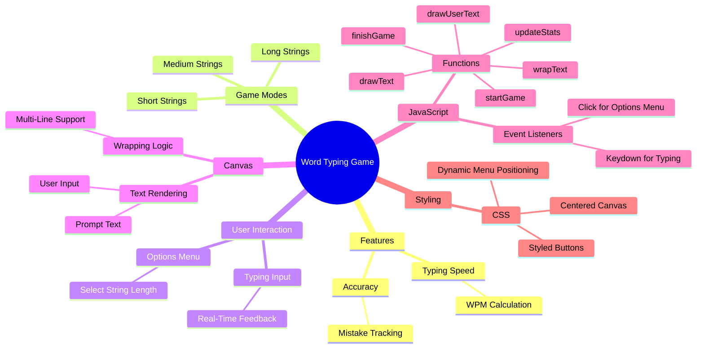

# Word Typing Game

| Role            | Name                 | GitHub |
|:---------------:|:--------------------:|:------:|
| 🧭 Lead Developer | **Torin Wolff**        | [GitHub](https://github.com/TDWolff) |

The Word Typing Game is designed to improve typing skills and hand-eye coordination. Players type words that appear on the screen as quickly and accurately as possible and try to achieve the fastest WPM with the highest accuracy. **Your assignment is to change the game by adding a personal touch to the game**.

This will give you practice with:
- Changing variables
- Adding custom features
- Using functions to update and display new features
- Using event listeners to handle user input

---

---

## Canvas Element

The `<canvas>` element is a powerful HTML feature that allows you to draw graphics, animations, and other visual elements directly on a web page. In the Word Typing Game, the `<canvas>` is used to display the text prompt and user input dynamically, providing real-time feedback to the player.

### Key Features of `<canvas>`:
- **Dynamic Drawing**: You can draw shapes, text, and images using JavaScript.
- **Real-Time Updates**: The canvas can be cleared and redrawn multiple times per second, making it ideal for interactive applications like games.
- **Customizable**: You can style the canvas and its content to match your design preferences.

---

## Your Job
- Explore how the `<canvas>` element is used in the Word Typing Game to render the text prompt and user input.
- Add your own enhancements to the canvas, such as:
  - Animations (e.g., fading text, moving elements).
  - A progress bar to show typing progress.
  - A visual indicator for the current character to be typed.
- Experiment with different fonts, colors, and styles to make the game more visually appealing.

---

## Steps to Add Your Feature

1. Review the existing code to understand how the `<canvas>` is set up and how text is rendered.
2. Plan your enhancements and decide how you want to implement them.
3. Write the necessary JavaScript functions to add your features.
4. Test your changes to ensure they work as expected and enhance the gameplay experience.
5. Make a final review and note your changes and improvements.

---

## What to Turn In/Show

- Your new updated game with a feature of your choice.
- A short demo of the game with your new feature.
- A brief explanation of how you implemented the feature.
