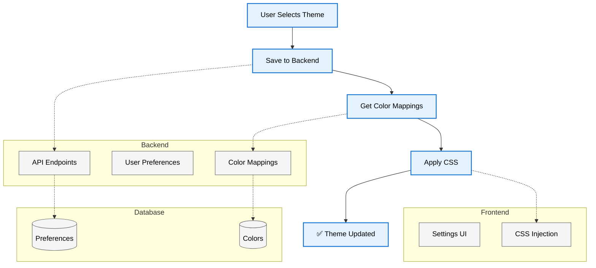

```mermaid
flowchart TD
    A[User Selects Theme] --> B[Save to Backend]
    B --> C[Get Color Mappings]
    C --> D[Apply CSS]
    D --> E[✅ Theme Updated]
    
    subgraph "Backend"
        F[API Endpoints]
        G[User Preferences]
        H[Color Mappings]
    end
    
    subgraph "Frontend"
        I[Settings UI]
        J[CSS Injection]
    end
    
    subgraph "Database"
        K[(Preferences)]
        L[(Colors)]
    end
    
    B -.-> F
    C -.-> H
    D -.-> J
    F -.-> K
    H -.-> L
    
    classDef main fill:#e3f2fd,stroke:#1976d2,stroke-width:2px,color:#000
    classDef component fill:#f5f5f5,stroke:#666,stroke-width:1px,color:#000
    
    class A,B,C,D,E main
    class F,G,H,I,J,K,L component
```